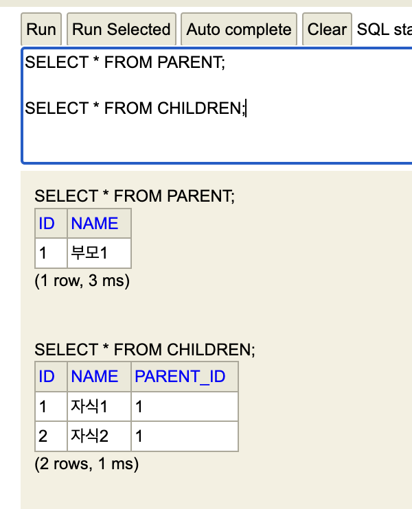
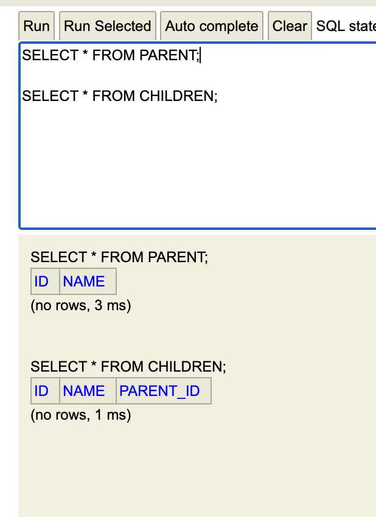
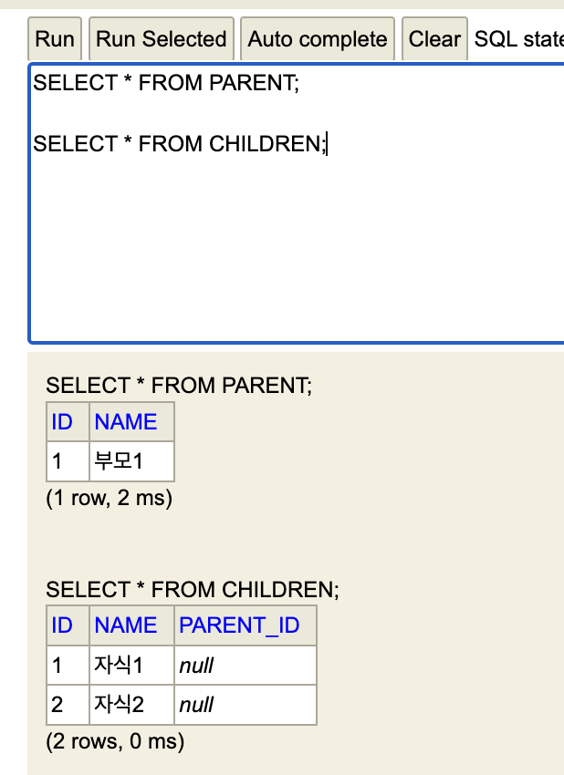

# JPA Cascade와 mappedBy를 공부할 때 오는 헷갈림(feat. orphanRemoval bug)

## 개요

JPA를 공부하면서 Cascade와 MappedBy에서 혼동(뭔가 기능상 영역이 겹쳐진다는 느낌)과 헷갈림, 모호함? 느꼈고, 그 내용을 정리해 보려고 한다.

## JPA Cascade(영속성전의)란

### JPA Cascade의 정의

JPA Cascade는 영속성전의를 말한다. 부모엔티티와 자식엔티티가 연관관계가 설정된 상황에서 부모엔티티의 영속성 상태 변화가 발생할 경우 해당 부모엔티티에 연관관계로 연결된 자식엔티티에도 자동으로 영속성 상태변화를 전파시키는 것을 말한다.

Cascade는 엔티티 선언시 연관관계를 설정할 때 옵션으로 설정할수 있으며, 다음과 같은 다양한 옵션으로 설정이 가능하다.

예를 들어 게시글과 게시글의 댓글이 있는경우, 게시글이 삭제될 때 해당 게시글의 댓글들이 같이 삭제되는 기능을 적용하고 싶을 때 유용하게 사용할 수 있는 기능이다.

> 쉽게 말해 부모엔티티가 퍼시스턴스 영속화가 될 때 영속화가 되기 전의 자식엔티티를 부모엔티티에 연관관계로 설정하면, 부모엔티티 영속화 시점에 자식 엔티티도 함께 자동으로 퍼시스턴스 영속화가 되고, 부모엔티티가 삭제되면 해당 부모엔티티의 자식 엔티티도 함께 삭제 가 되는 것이다.

> RDB에서 FK 설정시 사용되는 cascade와 비슷하다고 보면 이해가 쉽다.

### JPA Cascade 옵션 종류

아래 6개 정도의 JPA Cascade 옵션종류가 존재하는데 ALL, PERSIST, REMOVE 정도만 사용된다고 한다.(인프런 피셜)

- **CascadeType.ALL : 모두 적용**

  - 부모엔티티의 모든 영속성 상태변화가 자식엔티티에 반영된다.

- **CascadeType.PERSIST: 영속**

  - 부모엔티티가 퍼시스턴스될 때 자식엔티티도 함께 퍼시스턴트 상태가 된다.

- **CascadeType.REMOVE: 삭제**

  - 부모엔티티가 삭제될 때 자식엔티티도 함께 삭제 된다.

- CascadeType.MERGE: 병합
  - 부모엔티티가 merge 작업이 수행될 때 자식엔티티도 함께 merge 작업이 수행된다.
- CascadeType.REFRESH: REFRESH
  - entityManager.refersh() 작업으로 부모엔티티가 새로고침 될 때 자식엔티티도 함께 새로고침이 된다.(리프래쉬는 DB에서 해당 엔티티를 재 조회 하는 것을 의미한다.)
- CascadeType.DETACH: DETACH
  - 부모엔티티가 영속성 콘텍스트에서 detach되면 자식엔티티도 함께 detach된다.

### JPA Cascade 간단예제

- Parent 엔티티
  - 1:다 관계에서 CascadeType.All이 지정되어 있다.

```java
package com.example.jpaexample.entity;

import jakarta.persistence.*;
import lombok.Data;

import java.util.ArrayList;
import java.util.List;

@Data
@Entity
public class Parent {
    @Id
    @GeneratedValue(strategy = GenerationType.IDENTITY)
    @Column(name = "id", nullable = false)
    private Long id;

    private String name;

    @OneToMany(mappedBy = "parent", cascade = CascadeType.ALL)
    private List<Children> childrenList = new ArrayList<>();

    public void addChildren(Children children){
        this.childrenList.add(children);
        children.setParent(this);
    }

}
```

- Children 엔티티

```java
package com.example.jpaexample.entity;

import jakarta.persistence.*;
import lombok.Data;

@Data
@Entity
public class Children {
    @Id
    @GeneratedValue(strategy = GenerationType.IDENTITY)
    @Column(name = "id", nullable = false)
    private Long id;

    private String name;

    @ManyToOne
    @JoinColumn(name="parent_id")
    private Parent parent;
}
```

- 위처럼 Parent와 Chidren 엔티티가 1:다 연관관계일 경우 아래처럼 Parent에 Childen을 모두 담아 Parent 객체의 한번의 저장으로 연관된 Children 엔티티를 한꺼번에 저장할수 있다.

```java
Parent parent = new Parent();
parent.setName("부모1");

Children children1 = new Children();
children1.setName("자식1");

Children children2 = new Children();
children2.setName("자식2");

parent.addChildren(children1);
parent.addChildren(children2);

entityManager.persist(parent);
```

## JPA Cacade 사용시 유의점

Cascade 옵션은 신중하게 사용해야 한다.

무분별한 사용은 성능 저하나 데이터 무결성 문제를 야기할 수 있다.

의도치 않게 고아 데이터가 생성되거나, 반대로 삭제되면 안되는 데이터가 삭제되어 버리는 동작이 발생할수 있으므로 JPA Cascade 기능은 프로젝트내에서 사용규칙을 정하고 구현하는 비지니스에 주의하여 적용해야 한다.

> JPA Cascade의 사용시 주의해야 하는 경우의 예:
>
> A라는 부모, B라는 부모가 동시에 C라는 자식엔티티를 연관관계로 갖을 때, 만약 A라는 엔티티에서 Cascade.REMOVE가 설정되어 있고 A가 삭제가 되는 경우 B부모 엔티티에서는 연관관계가 깨지는 상황이 발생하게 된다.

> TIP.
> 부모엔티티와 자식엔티티의 라이프라이클이 거의 동일하고,
> 자식엔티티가 한 부모엔티티에만 속한경우에 편의성을 위해 JPA Cascade를 고려해 보자.

### 고아객체

- 고아객체란 부모엔티티와 연관관계가 끊어진 자식 엔티티를 말한다.
- 이런 고아객체를 자동으로 삭제하는 옵션 또한 존재한다.
  - orphanRemoval = true

아래는 orphanRemoval의 예이다. 다음과 같이 설정된 경우 부모엔티티와 연관관계가 끊어진 Children 엔티티는 DB에서 지워지게 된다.

orphanRemoval 설정은 @OneToOne, @OneToMany 연관관계에서 설정이 가능하다.

```java
@Data
@Entity
public class Parent {
    @Id
    @GeneratedValue(strategy = GenerationType.IDENTITY)
    @Column(name = "id", nullable = false)
    private Long id;

    private String name;

    @OneToMany(mappedBy = "parent", cascade = CascadeType.ALL)
    private List<Children> childrenList = new ArrayList<>();

    public void addChildren(Children children){
        this.childrenList.add(children);
        children.setParent(this);
    }

}
```

- orphanRemoval = true 와 CascadeType.REMOVE의 차이점
  - 얼핏보면 두개가 동일한 기능을 하는것 처럼 보일수도 있지만 약간 차이가 있다.
  - CascadeType.Remove
    - 부모 엔티티가 삭제될 때, 연관된 자식 엔티티도 함께 삭제된다. 단순히 부모 엔티티가 삭제되었을 때, 관련된 자식 엔티티를 삭제하는 데 사용된다.
  - orphanRemoval = true
    - 부모 엔티티와의 관계가 끊어진 자식 엔티티를 삭제한다. 부모 엔티티가 삭제되지 않더라도, 관계가 끊어진 자식 엔티티는 삭제된다. 관계가 끊어진 "고아" 엔티티를 자동으로 삭제하는 기능을 제공한다.

### Cascade.ALL + orphanRemoval =true 인 경우 부모엔티티는 자식엔티티의 모든 라이프사이클을 관리한다.

Cascade.ALL + orphanRemoval = true 가 된 경우 부모엔티티에서 자식엔티티의 라이프사이클을 전부 관리 할수 있다.

이 경우 자식엔티티는 별도의 DAO, Repository 등을 생성하지 않고 이런 기능들을 부모엔티티에 넘길 수 있게 된다.

도메인 주도 설계(DDD)의 Aggregate Root 개념을 구현 할 수 있다.

## JPA mappedBy란

mappedBy는 JPA에서 양방향 연관관계를 설정할 때, 연관관계의 주인이 누구인지 설정하는 것이다.
양방향 연관관계에서만 사용되므로 @OneToMay, @ManyToMany 에서만 설정이 가능하다.
연관관계의 주인이라는 말은 DB에서 연관관계를 설정하기 위해서는 참조키가 필요한데, 이 참조키를 실제 소유하는 엔티티를 연관관계의 주인 엔티티라 부른다.
즉 mappedBy 설정이란 이런 양방향 연관관계에서 어떤 엔티티에 실제 연관관계를 위한 참조키를 저장할 것인지를 설정하는 기능이다.

아래 Parent 엔티티에 mappledBy = “parent” 라는 설정의 의미는 **나 Parent 엔티티는 양방향 연관관계의 주인이 아니다.** 라는 의미이다.

나 말고 상대 엔티티인 Children 엔티티가 연관관계의 주인이며, 해당 엔티티의 parent 라는 프로퍼티가 실제 DB에서 참조키를 저장하는 컬럼이다 라고 명시한 것이다.

```java
@Data
@Entity
public class Parent {
    @Id
    @GeneratedValue(strategy = GenerationType.IDENTITY)
    @Column(name = "id", nullable = false)
    private Long id;

    private String name;

    @OneToMany(mappedBy = "parent", cascade = CascadeType.ALL)
    private List<Children> childrenList = new ArrayList<>();

    public void addChildren(Children children){
        this.childrenList.add(children);
        children.setParent(this);
    }

}
Data
@Entity
public class Children {
    @Id
    @GeneratedValue(strategy = GenerationType.IDENTITY)
    @Column(name = "id", nullable = false)
    private Long id;

    private String name;

    @ManyToOne
    @JoinColumn(name="parent_id")
    private Parent parent;
}
```

> mappedBy 사용시 헷갈리는 부분은 연관관계의 주인이 아닌 엔티티에 mappedBy 설정이 들어간다는 것이다.
> mappedBy 옵션이 보인다면 해당 엔티티의 반대편 엔티티가 연관관계의 주인이며, 그 주인 엔티티에 실제 FK 가 저장된다.

### 연관관계 주인의 권한 : 연관관계를 설정할 수 있는 권한은 연관관계 주인이 갖는다.

위 예제에서 연관관계의 주인은 Children이다. 즉 Children 엔티티에서 setParent 호출만이 실제 연관관계를 설정하게 된다.

아래 Parent 부모엔티티의 addChildren 메소드를 보면 children.setParent를 호출하는 것을 볼 수 있다. 만약 children.setParent를 호출하지 않게 되면, Parent, Children 엔티티는 DB에 저장되지만 연관관계 없이 저장되게 된다.

```java
public void addChildren(Children children){
        this.childrenList.add(children);
        children.setParent(this);
}
```

## 난 왜 Cascade와 mappedBy가 혼동되는가

혼동을 테스트할 예제를 준비하겠다.
예제 코드에서는 cascade를 사용하지 않고, **Parent 엔티티에 mappedBy, orphanRemoval = true 만 설정한 상태이다.**

addChildren, removeChildren의 동작을 자세히 확인하길 바란다.

- 엔티티

```java

@Data
@Entity
public class Parent {
    @Id
    @GeneratedValue(strategy = GenerationType.IDENTITY)
    @Column(name = "id", nullable = false)
    private Long id;

    private String name;

    @OneToMany(mappedBy = "parent", orphanRemoval = true)
    private List<Children> childrenList = new ArrayList<>();

    public void addChildren(Children children){
        this.childrenList.add(children);
        children.setParent(this);
    }

    public void removeChildren(Children children){
        this.childrenList.remove(children);
        children.setParent(null);
    }
}

@Data
@Entity
public class Children {
    @Id
    @GeneratedValue(strategy = GenerationType.IDENTITY)
    @Column(name = "id", nullable = false)
    private Long id;

    private String name;

    @ManyToOne
    @JoinColumn(name="parent_id")
    private Parent parent;
}

```

- 테스트 코드

```java
Parent parent = new Parent();
parent.setName("부모1");

Children children1 = new Children();
children1.setName("자식1");

 Children children2 = new Children();
children2.setName("자식2");

parent.addChildren(children1);
parent.addChildren(children2);

entityManager.persist(parent);
entityManager.persist(children1);
entityManager.persist(children2);

Parent parent = new Parent();
```

실행결과는 다음과 같다.
Chidlren 엔티티가 연관관계의 주인이며, 연관관계 설정코드는 Parent 엔티티에서 children.setParent 를 호출하여 설정되었다.



### 혼동 : Cascasde.Remove 설정없이 mappedBy와 orphanRemoval = true 설정으로 비슷한 동작이 발생

테스트코드

```java
Parent parent = new Parent();
parent.setName("부모1");

Children children1 = new Children();
children1.setName("자식1");

Children children2 = new Children();
children2.setName("자식2");

parent.addChildren(children1);
parent.addChildren(children2);

entityManager.persist(parent);
entityManager.persist(children1);
entityManager.persist(children2);

entityManager.remove(parent);        // Parent 객체를 삭제해보자.

```

테스트코드의 결과



Parent 엔티티에 Cascade 설정이 없지만, Parent 엔티티가 삭제되면서 고아객체가 되버린 Children 엔티티가 orphanRemoval = true에 의하여 삭제 되었다.

JPA설명을 보면 Cascade.remove없이 mappedBy와 orphanRemoval = true 설정을 한 상태에서 부모엔티티가 삭제된 경우 자식엔티티가 삭제되는 동일한 동작을 보여주게 된다.

### orphanRemoval = true 의 버그라고 생각되는 동작. 연관관계가 끊어졌지만 제거되지 않는 자식엔티티

테스트 코드

```java
//Casecade 예제
Parent parent = new Parent();
parent.setName("부모1");

Children children1 = new Children();
children1.setName("자식1");

Children children2 = new Children();
children2.setName("자식2");

parent.addChildren(children1);
parent.addChildren(children2);

entityManager.persist(parent);
entityManager.persist(children1);
entityManager.persist(children2);

parent.removeChildren(children1);  // Parent객체에서 Children 객체를 제거하는 코드
parent.removeChildren(children2);  // Parent객체에서 Children 객체를 제거하는 코드
```

테스트코드의 결과



Parent 엔티티의 removeChildren 코드를 잠깐 보자.

```java
public void removeChildren(Children children){
  this.childrenList.remove(children);
  children.setParent(null);
}
```

Parent앤티티에서 chidlrenList에서 특정 Children 엔티티를 제거하고, 해당 Children의 엔티티의 setParent(null)을 호출함으로써 Parent와 Children가의 연관관계를 제거한다.

**나는 이렇게 하면 Children객체는 고아객체기 되고, 이 고아객체는 Parent 앤티티에서 설정한 orphanRemovel = true 설정에 의하여 DB에서 제거될 줄 알았았다.**

하지만 결과는 Children 객체의 FK 프로퍼티에 null이 셋팅될 뿐이다. (연관관계는 끊어졌다.)

JPA스팩상 연관관계가 끊어진 고아객체는 orphanRemoval = true 에 의하여 제거 되어야 한다.
해당내용을 구글링해보니 해당동작이 버그ㄴ같다는 언급이 많다.

**orphanRemoval = true 는 가급적 사용하지 않는 편이 안전해보인다.**
인터넷에서는 부모엔티티에서 Cascade.ALL과 함께 사용시에는 동작한다고 했지만, 내 경우에는 정상동작하지 않았다.

## 정리

- Cascade와 mappedby는 별개다.
- Cascade는 영속성 라이프사이클에 관련된 어떤 이벤트가 발생시 그 이벤트를 자식 엔티티에 전파 할 것인지에 대한 설정이다.
- mappedBy는 양방향 연관관계에서 연관관계의 주인을 명시하는 설정이다.
- **mappedBy와 orphanRemoval = true를 같이 사용하면, 부모엔티티가 삭제 시 Cascade.Remove와 동일한 동작을 한다. => 2개의 다른 설정으로 동일한 동작을 해서 이부분이 햇갈렸다.**
- Cascade.ALL + orphanRemoval = true 같이 사용하면, 부모엔티티에서 자식엔티티의 라이프사이클을 완전히 컨트롤 할 수 있다.
  - 자식엔티티의 DAO, repository를 만들지 않을 수도 있다.
- **orphanRemoval=true의 동작에 버그가 있는듯 하다.(2023.05.21) 주의하여 사용할 필요가 있다.**

## 참고자료

- 인프런 - 자바 ORM 표준 JPA 프로그래밍 -기본편 (김영환)
- 책 - 자바 ORM 표준 JPA 프로그래밍 (김영환)
- chatGPT

- JPA orphanRemoval 버그: https://github.com/jyami-kim/Jyami-Java-Lab/issues/1
