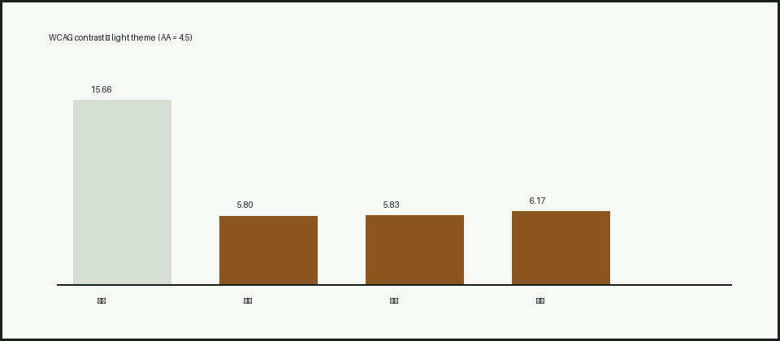
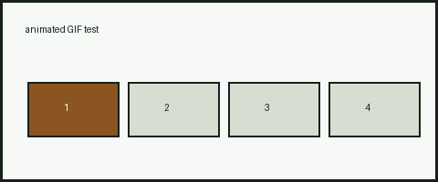
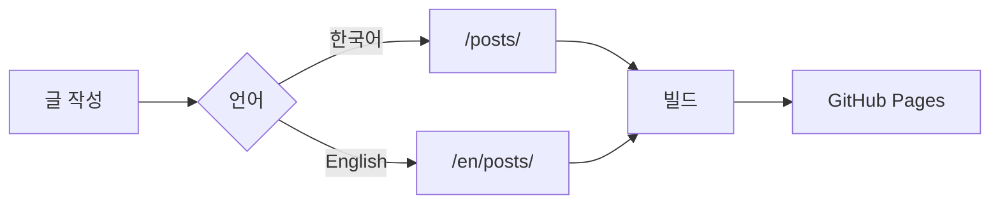
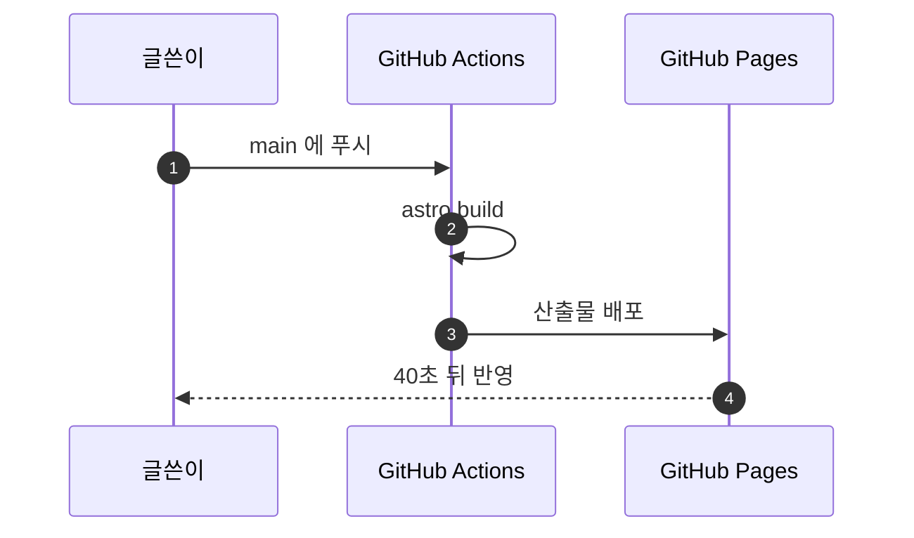

글에 무엇을 넣을 수 있는지 확인하는 글이다. 결론보다 **어떤 경로로 넣었을 때 무엇이 달라지는지**가 요점이다.

## 1. 정지 이미지 — 글 폴더 안

이 글은 폴더 하나다. 본문이 `index.md`이고 이미지가 그 옆에 있다.

```
posts/ko/2026-09-07-media-test/
  index.md
  contrast.png
  frames.gif
```

본문에서 `./contrast.png`로 부른다. Astro가 크기·형식을 바꿔 내보낸다.



## 2. 애니메이션 GIF — 최적화 경로

같은 방식으로 GIF를 넣으면 어떻게 되는가.



## 3. 애니메이션 GIF — `public/` 경로 (쓰지 않는 쪽)

같은 파일을 `public/`에 두고 절대 경로로 부른다. 손대지 않고 그대로 나간다.

★ **이 방식은 쓰지 않기로 했다.** 이유가 둘이다. ① 자산이 글에서 떨어져 나가
어느 이미지가 어느 글 것인지 알 수 없게 된다. ② **편집기에서 안 보인다** —
`/media/frames.gif`는 사이트의 루트 기준 경로라서 VS Code가 파일 위치를 기준으로
풀지 못한다. 아래 그림이 편집기 미리보기에서는 깨져 보이는 것이 그 증거다.


## 4. 머메이드 다이어그램



★ **라벨에 슬래시가 있으면 큰따옴표로 감싸야 한다.** 처음에는 `C[/posts/]`라고
썼는데 머메이드에서 `[/ … /]`는 **평행사변형 도형 문법**이라, 안쪽의 슬래시가
닫는 기호로 읽혀 `Syntax error in text`가 났다. `C["/posts/"]`로 감싸면 된다.

## 4-2. 시퀀스 다이어그램

흐름도 말고 다른 종류도 되는지 확인한다.



## 5. 비교용 코드 블록

```ts
export function greet(name: string): string {
  return `Hello, ${name}!`;
}
```

## 6. 잰 값

| 넣은 방식     | 나가는 형식 |    원본 |        결과 | 애니메이션 |
| ------------- | ----------- | ------: | ----------: | ---------- |
| 상대 경로 PNG | WebP        | 6,539 B | **3,724 B** | —          |
| 상대 경로 GIF | WebP        | 6,172 B | **2,390 B** | **유지됨** |
| `public/` GIF | GIF 그대로  | 6,172 B |     6,172 B | 유지됨     |

## 7. 결론

**세 가지 다 된다.** 다만 넣는 방식에 따라 결과가 다르다.

- **이미지와 GIF는 글 옆에 두고 상대 경로로 부르는 것이 낫다.** Astro가 WebP로
  바꾸면서 절반 아래로 줄인다. ★ **애니메이션 GIF도 애니메이션이 살아 있는
  WebP가 된다** — 이건 미리 짐작하지 말고 재 봐야 아는 부분이었다.
- ★ **글 하나가 폴더 하나다.** 본문 `index.md`와 그 글의 이미지가 한자리에
  있으므로 **글을 지우면 자산도 같이 사라진다.** 그리고 상대 경로라서
  **VS Code 미리보기에 그대로 보인다.**
- **`public/`은 쓰지 않는다.** 원본 바이트를 그대로 내보내야 하는 경우에만
  예외로 둔다. 편집기에서 안 보이는 것이 대가다.
- **머메이드는 기본으로는 안 된다.** 코드 블록으로 색만 입혀진다. 이 사이트는
  ` ```mermaid `를 `<pre class="mermaid">`로 바꾸는 remark 플러그인과,
  다이어그램이 있는 글에서만 라이브러리를 내려받는 스크립트를 붙여서 켰다.

### 붙이면서 걸린 것 둘

**하나. 라벨의 슬래시.** 위 4절에 적었다.

**둘. 코드 복사 버튼.** 이 테마는 모든 `<pre>` 안에 복사 버튼을 넣는데, 그 버튼의
글자 `Copy`가 다이어그램 정의 끝에 붙어 버렸다. **정의는 멀쩡한데 `Syntax error in
text`가 뜨는** 상태였고, 정의를 `mermaid.parse`에 직접 넣어 보고서야 문법이 아니라
오염이라는 것이 드러났다. 복사 버튼 선택자를 `pre:not(.mermaid)`로 좁혀 고쳤다.
