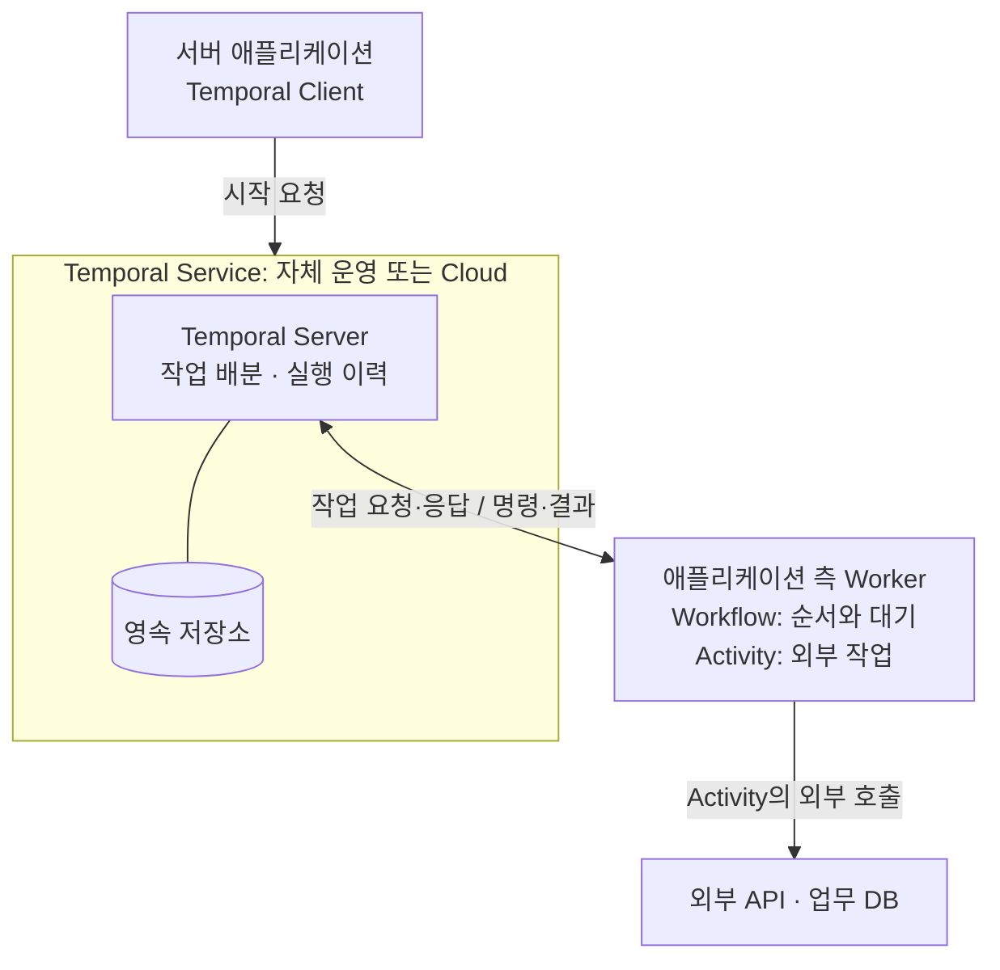
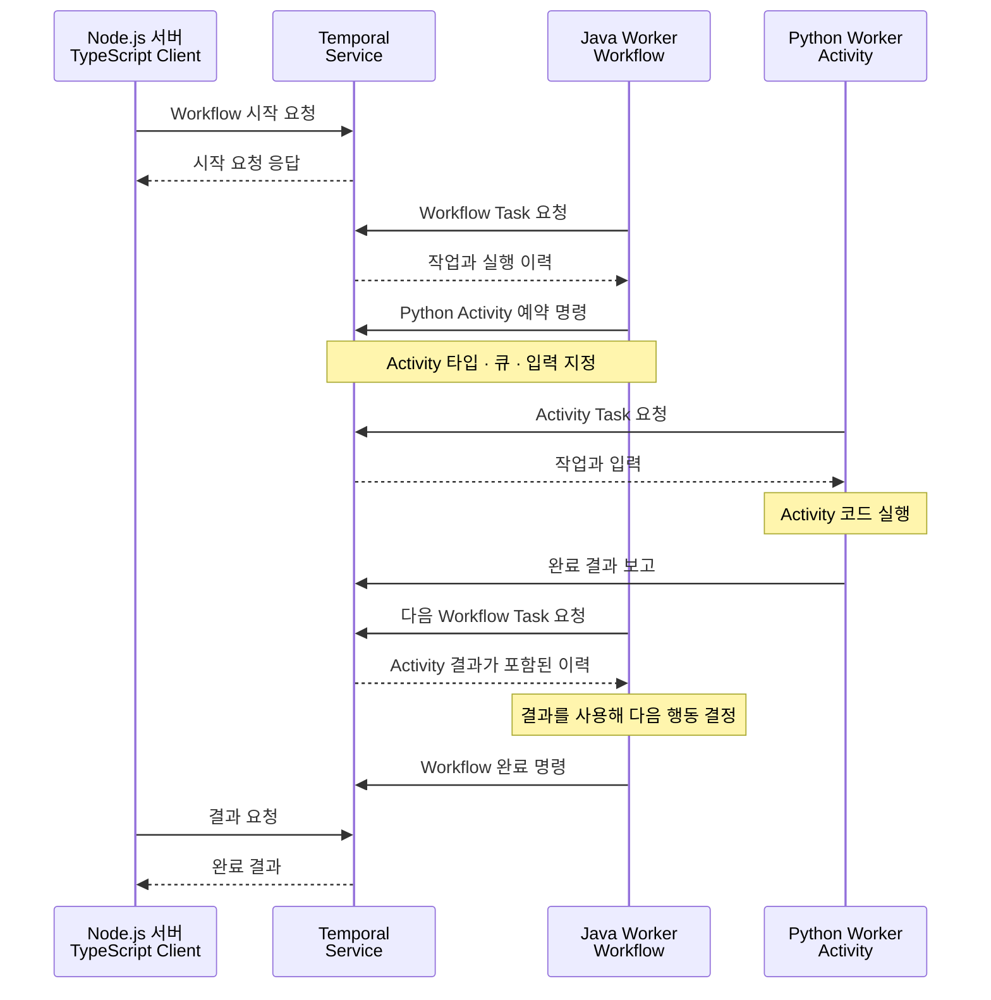

공연 예매 서비스에서 결제는 승인됐는데 티켓 발급 직전에 서버가 종료됐다고 가정해 보자. 서버를 다시 켜는 것만으로 처리가 끝날까? 결제가 끝났다는 사실을 확인하고, 티켓이 이미 발급됐는지 살펴보고, 아직 하지 못한 일을 이어서 실행해야 한다. 같은 요청이 다시 들어왔다고 결제부터 반복해서도 안 된다.

이런 문제는 예매에만 생기지 않는다. 파일을 변환한 뒤 업로드하는 작업, 여러 서비스에 걸친 회원 가입, 외부 승인을 기다리는 신청 처리에서도 중간 결과와 다음 행동을 기억해야 한다. 정상 흐름은 몇 번의 함수 호출로 표현할 수 있지만, 장애 뒤에도 그 흐름을 유지하려면 별도의 설계가 필요하다.

특히 하나의 업무가 네트워크로 연결된 여러 서비스를 거치는 MSA 환경에서는 일부 작업만 완료된 채 중단되는 상황을 고려해야 한다. 다만 멀티모듈은 코드를 나누는 방식이므로, 그 자체가 분산 실행이나 분산 트랜잭션을 뜻하지는 않는다. 여러 모듈이 하나의 프로세스와 같은 DB 트랜잭션 안에서 동작하는지, 별도 서비스나 외부 API를 호출하는지에 따라 필요한 실패 처리가 달라진다.

Temporal은 이처럼 **중간에 멈출 수 있는 업무의 진행을 기록하고, 장애 뒤에도 이어갈 수 있도록 돕는 실행 플랫폼**이다. 이 글에서는 Temporal의 구성과 동작을 살펴보고, **실행 이력 저장, 설정한 정책에 따른 실패 작업의 재시도, 타이머·외부 응답 대기, Worker 장애 후 실행 복구**를 Temporal이 어떻게 지원하는지 설명한다. 이어서 개발자가 정해야 하는 **업무 처리 순서와 성공·실패 조건, 재시도 횟수·간격과 타임아웃, 중복 결제 방지, 실패 시 결제 취소 같은 보상 규칙**을 구분한다. 예매 상황은 이 역할 차이를 설명하기 위한 가상 예시다. ([Temporal 소개](https://docs.temporal.io/temporal))

## 정상 흐름보다 어려운 것은 중단 이후다

간단한 예매 처리라면 좌석을 확보하고, 결제를 승인하고, 티켓을 발급하는 순서를 떠올릴 수 있다. 그런데 각 작업을 서로 다른 서비스가 처리하면 한 번의 함수 호출이 끝났다는 사실만으로 전체 업무가 끝나지는 않는다.

다음과 같은 상황을 생각해 보자.

1. 결제 서비스가 승인했지만 응답을 보내던 중 네트워크 연결이 끊겼다.
2. 우리 서버는 결제가 됐는지 알 수 없는 상태가 됐다.
3. 사용자가 다시 요청했거나 서버가 재시작됐다.
4. 서버는 기존 결과를 확인한 뒤 예매를 계속할지, 결제를 취소할지 결정해야 한다.

여기서 재시도만 추가하면 해결될 것 같지만, 언제 무엇을 다시 실행해야 하는지가 남는다. 이미 끝난 작업, 결과를 모르는 작업, 아직 시작하지 않은 작업을 구별해야 하기 때문이다. 일정 시간 뒤 다시 확인할 일도 저장해야 하고, 자동으로 처리하지 못한 건은 사람이 확인할 수 있어야 한다.

직접 구현한다면 진행 상태를 DB에 저장하고, 남은 일을 찾는 작업자를 만들고, 재시도 간격과 종료 조건을 관리할 수 있다. 여러 서비스가 참여한다면 중복 요청으로 같은 결제나 발급이 반복되지 않도록 멱등성을 설계하고, 일부 작업만 끝났을 때 재시도·결과 확인·보상으로 업무를 마무리하는 규칙도 정해야 한다. 이 책임은 Temporal을 도입해도 남는다. ([Activity와 멱등성](https://docs.temporal.io/activity-definition))

Temporal을 검토하는 이유는 이런 실행 관리가 여러 업무에서 반복될 때 공통 기능을 활용할 수 있기 때문이다. 어떤 업무 상태를 성공으로 볼지는 여전히 애플리케이션이 정한다.

## Temporal의 출발점과 Durable Execution

Temporal의 공동 창업자는 Maxim Fateev와 Samar Abbas다. 두 사람은 Uber에서 Cadence를 만들었고, 2019년 독립해 Temporal을 시작했다. Temporal은 Cadence에서 갈라져 발전한 프로젝트이며 Temporal Technologies가 개발을 이끈다. ([공식 역사](https://temporal.io/blog/temporal-raises-usd550m-series-e-at-usd12-55b-valuation-ai), [Cadence와의 관계](https://temporal.io/temporal-versus/cadence))

서버와 SDK 소스는 GitHub의 temporalio 조직에서 공개한다. 구성 요소별 라이선스는 구분해서 확인해야 한다. Temporal Server는 MIT, 이 연재에서 Kotlin과 함께 사용할 Java SDK는 Apache-2.0이다. ([Server 라이선스](https://github.com/temporalio/temporal/blob/main/LICENSE), [Java SDK 라이선스](https://github.com/temporalio/sdk-java/blob/master/LICENSE))

Temporal의 현재 개발 주체와 서비스 운영 주체도 구별하자. **Temporal Technologies Inc.가 플랫폼 개발을 이끌고 Temporal Cloud를 제공한다.** Uber는 앞서 설명한 Cadence의 출발점이다. 직접 설치하면 우리 팀이 Temporal Service와 저장소를 운영하고, Cloud를 선택하면 해당 운영을 맡길 수 있다. 일반적인 구성에서 업무 코드를 실행하는 Worker의 배포와 외부 시스템 접근은 우리 팀이 관리한다. 소스 코드와 변경 이력은 GitHub의 temporalio 조직에서 확인할 수 있다. ([Cloud 제공 법인과 약관](https://temporal.io/terms-of-service), [플랫폼 구성](https://docs.temporal.io/temporal), [공식 Server 저장소](https://github.com/temporalio/temporal))

Temporal이 설명하는 핵심 개념은 **Durable Execution**이다. 이 글에서는 이를 “프로세스가 종료돼도 기록된 진행을 바탕으로 이어갈 수 있는 실행”으로 이해하면 된다. 하나의 업무 실행을 Workflow Execution이라고 부른다. 몇 초 만에 끝나는 처리도, 외부 응답을 오래 기다리는 처리도 같은 실행 안에서 표현할 수 있다. ([Workflow Execution](https://docs.temporal.io/workflow-execution))

이때 보존하는 것은 실행 중인 컴퓨터의 메모리 전체가 아니다. Temporal은 실행에 필요한 사건을 Event History에 기록한다. Workflow 시작, Activity 완료, 타이머 만료 같은 사건이 복구의 근거가 된다. 이 기록은 장애 분석에도 사용할 수 있다. ([Event History](https://docs.temporal.io/workflow-execution/event))

## 내가 만든 코드는 Worker가 실행하고, Temporal은 진행 이력을 저장한다

처음에는 Workflow와 Activity를 나누어 이해하는 것이 좋다. **Workflow는 업무 순서·조건·대기를 표현하는 코드**, **Activity는 외부 API 호출이나 DB 변경처럼 실제 외부 작업을 수행하는 코드**다. 예매에서는 “결제를 확인한 다음 티켓을 발급한다”는 순서를 Workflow에, 결제 조회와 티켓 발급 요청을 Activity에 둘 수 있다.

### DDD 관점에서 보는 서비스 간 조정 — 나의 설계 관점

DDD에서는 도메인의 규칙과 모델을 명확한 경계 안에 두고, 외부 시스템의 기술적인 세부 사항이 도메인 모델에 직접 섞이지 않도록 설계한다. 그렇다고 서비스 간 협력 자체가 잘못된 것은 아니다. 여러 서비스가 함께 수행하는 업무에는 호출 순서와 대기·실패 처리를 조정하는 코드가 필요하다. ([도메인 계층과 애플리케이션 계층의 책임](https://learn.microsoft.com/en-us/dotnet/architecture/microservices/microservice-ddd-cqrs-patterns/ddd-oriented-microservice))

내가 DDD를 적용하면서 고민한 것도 이 조정 코드를 어디에 둘 것인가였다. 예매에서는 좌석 확보 가능 여부와 결제 취소 가능 여부를 각각 담당 서비스가 판단하고, Workflow는 어떤 순서로 요청하고 기다리며 실패에 대응할지를 관리하도록 나눌 수 있다. 나는 이런 서비스 간 조정을 업무별 Workflow에 모으면 흐름을 파악하고 변경하기 쉬울 것으로 본다. 이는 이 글에서 검토하려는 설계 방향이며, Temporal이 도메인 경계를 자동으로 지켜 준다는 뜻은 아니다.

Facade가 여러 기능을 단순한 인터페이스로 제공한다면, 여기서 필요한 조정은 실행 순서·대기·실패 후 진행까지 다룬다. 따라서 Facade와 동일한 패턴으로 단정하지 않고, 서비스 간 업무 흐름을 조정하는 역할로 설명하겠다. 각 서비스의 내부 규칙까지 하나의 Workflow에 몰아넣지 않는 것이 중요하다. 이 조정 코드는 Temporal Server 내부가 아니라 우리가 운영하는 Worker에서 실행된다. ([Temporal의 실행 구조](https://docs.temporal.io/encyclopedia/architecture/how-temporal-works))

### Worker는 코드를 실행하고, Temporal Service는 이력과 작업 전달을 관리한다

그 코드가 실행되는 곳은 Worker다. 전체 구성은 다음과 같다. ([플랫폼 구성](https://docs.temporal.io/temporal), [실행 구조](https://docs.temporal.io/encyclopedia/architecture/how-temporal-works))

| 구성 요소        | 역할                                                                           |
| ---------------- | ------------------------------------------------------------------------------ |
| Client           | 애플리케이션이 Workflow 시작·취소·메시지 전달 등을 요청하는 SDK 객체           |
| Workflow         | 업무의 순서, 분기, 대기 조건을 정의하는 코드                                   |
| Activity         | 외부 API 호출·DB 변경 등 외부 작업을 수행하는 코드                             |
| Worker           | Task Queue에서 작업을 받아 Workflow·Activity 코드를 실행하는 프로세스          |
| Temporal Service | 실행 이력과 작업 배분을 관리하는 서비스. Temporal Server와 영속 저장소로 구성  |
| SDK              | Client와 Worker를 구현하고 Workflow·Activity를 작성하는 데 사용하는 라이브러리 |

그림 1. Temporal Service는 실행 이력과 작업 배분을 관리하고 Worker가 업무 코드를 실행한다. 양방향 연결은 Worker의 작업 요청과 Temporal Service의 응답, 명령·결과 보고를 뜻한다. Workflow와 Activity를 같은 Worker에 둘 수도, 여러 Worker로 나눌 수도 있다. 그림은 일반적인 배포 관계이며 물리 서버 수를 지정하지 않는다.

[Mermaid 편집 원본 다운로드](./assets/temporal-roles.mmd)

**Temporal Service는 Temporal Server와 실행 이력을 보관하는 저장소를 합쳐 부르는 이름이다.** 예매·결제 같은 업무 서비스와 구분하기 위해 이 글에서는 줄여 쓰지 않는다. Task Queue는 Worker가 받아 갈 작업을 구분하는 대기열이다. 기본 흐름을 단순화하면 다음과 같다.

1. 애플리케이션이 Client로 Workflow 시작을 요청한다.
2. Temporal Service가 Workflow 시작 요청을 실행 이력에 기록하고, Worker가 가져갈 Workflow Task를 Task Queue에 넣는다.
3. Worker가 작업을 받아 Workflow 코드를 실행한다.
4. Workflow가 Activity 실행을 요청하면 Temporal Service가 해당 작업을 배분한다.
5. Worker가 Activity를 실행하고 결과를 Temporal Service에 보고한다.
6. 기록된 결과를 바탕으로 Workflow가 다음 행동을 결정한다.

따라서 Temporal Server에 업무 코드를 올리면 서버가 그 코드를 직접 실행하는 구조로 이해하면 안 된다. Workflow와 Activity 코드는 Worker가 실행한다. Temporal Service는 기록과 작업 배분을 담당한다. ([실행 과정](https://docs.temporal.io/encyclopedia/architecture/how-temporal-works))

## Node.js·Python 서버도 함께 참여할 수 있다

Temporal은 Java·Kotlin 전용 도구가 아니다. **2026-10-05 기준 공식 SDK는 .NET, Go, Java, PHP, Python, Ruby, Rust, TypeScript의 8종**이다. Rust SDK도 2026-09-23 정식 지원인 GA를 발표했다. Kotlin은 Java SDK를 사용하고 Kotlin 보조 모듈을 추가할 수 있다. 각 SDK의 최신 기능과 실행 환경 조건은 별도로 확인해야 한다. ([SDK 목록](https://docs.temporal.io/develop), [Rust GA 발표](https://temporal.io/blog/build-durable-applications-rust-temporal-rust-sdk-now-generally-available), [Kotlin 지원 모듈](https://github.com/temporalio/sdk-java/blob/main/temporal-kotlin/README.md))

Node.js에서는 TypeScript SDK로 TypeScript·JavaScript 코드를 작성할 수 있고, Python SDK도 Client·Workflow·Activity·Worker를 제공한다. TypeScript Worker는 Node.js의 실행 기능에 의존하므로 브라우저나 모든 JavaScript 런타임에서 그대로 실행된다고 보면 안 된다. ([TypeScript SDK](https://github.com/temporalio/sdk-typescript), [Python SDK](https://python.temporal.io/))

### SDK로 서로 다른 언어의 작업을 연결한다

서버마다 언어가 달라도 역할별 Worker와 데이터 계약을 정하면 함께 사용할 수 있다. 아래는 문서에 근거한 구성 예시이며, 이 글에서 실행한 실습 결과는 아니다.

1. Node.js API 서버의 Client가 Workflow 타입 이름과 ID, 처리할 Task Queue, 입력을 지정해 Temporal Service에 시작을 요청한다.
2. Java·Kotlin Worker가 해당 큐에서 작업을 받아 Workflow 코드를 실행한다.
3. Workflow가 Python Activity의 타입 이름과 처리 큐를 지정해 실행을 요청한다.
4. Python Worker가 그 큐에서 작업을 받아 실행하고 결과를 Temporal Service에 보고한다.
5. Temporal Service에 기록된 결과를 Java·Kotlin Workflow가 다음 작업을 통해 받아 후속 단계를 진행한다.

그림 2. 서로 다른 언어가 Temporal Service를 통해 작업과 결과를 주고받는 정상 흐름이다. Workflow·Activity는 역할에 맞는 별도 Task Queue를 사용하며 같은 Namespace 접근·인증·타입 이름·입력과 결과 형식을 맞춰야 한다. 시작 응답은 업무 완료가 아니다. 결과 대기 요청은 완료 전에 보낼 수도 있다. 재시도·타임아웃·보상은 이 그림에서 생략했다.

[Mermaid 편집 원본 다운로드](./assets/temporal-polyglot.mmd)

여기서 Node.js가 Java Worker에 직접 HTTP 요청을 보내는 것은 아니다. **Worker가 Temporal Service에서 작업을 가져오고 결과를 보고한다.** 공식 다언어 샘플도 Java Workflow에서 Go·Node.js Activity를 호출하는 구성을 제공한다. 언어마다 별도 처리 큐를 두면 실행할 타입을 모르는 Worker가 작업을 받는 문제를 피하기 쉽다. ([공식 다언어 샘플](https://github.com/temporalio/temporal-polyglot), [Task Queue](https://docs.temporal.io/task-queue))

입력·결과의 필드명, 숫자·날짜·null 표현, 오류와 재시도 정책을 맞춰야 한다. 암호화·압축을 적용하면 데이터 변환 설정도 호환되어야 한다. Java 객체가 Python 객체로 자동 공유되는 것은 아니다. 또한 서로 다른 언어의 작업을 호출할 수 있다는 설명은 Python Worker가 Java Workflow 구현을 그대로 이어받는다는 뜻이 아니다. ([데이터 변환](https://docs.temporal.io/dataconversion), [Workflow 정의와 재생](https://docs.temporal.io/workflow-definition))

### 기존 HTTP 서버를 그대로 호출할 수도 있다

기존 Node.js·Python 서버를 모두 Worker로 바꿀 필요는 없다. Activity가 기존 HTTP API를 호출하는 방법도 있다.

1. Workflow가 Activity 실행을 요청한다.
2. Activity Worker가 기존 서버의 HTTP API를 호출한다.
3. Activity가 API 결과를 보고하고 Workflow가 다음 단계를 결정한다.

이 방식에서는 호출받는 서버에 Temporal SDK가 없어도 된다. 다만 기존 API 내부의 진행까지 Temporal이 자동으로 기록하는 것은 아니다. API가 처리에 성공했는데 응답이 끊기면 Activity가 호출을 다시 시도할 수 있으므로 요청 ID와 멱등성 계약은 계속 필요하다. ([Activity의 역할](https://docs.temporal.io/activities))

## Worker가 종료되면 어떻게 이어가는가

결제 확인 Activity가 끝났고, 그 성공 결과가 Temporal에 기록됐다고 가정해 보자. 다음 Activity를 요청하기 전에 Worker가 종료되더라도 새 Worker는 저장된 이력을 바탕으로 Workflow 상태를 재구성할 수 있다. 이를 **replay, 이력 재생**이라고 부른다.

Workflow 코드는 재생 과정에서 다시 실행될 수 있다. 하지만 이미 완료 결과가 이력에 남은 Activity를 만났을 때는 그 결과를 이용한다. 이력 재생 자체가 완료된 결제 API를 다시 호출한다는 뜻은 아니다. ([Workflow 정의와 재생](https://docs.temporal.io/workflow-definition))

반면 **결제사에서는 승인이 끝났지만 Worker가 완료를 보고하기 전에 종료된 상황**은 다르다. Temporal에 완료가 기록되지 않았으므로 설정된 타임아웃과 재시도 정책에 따라 Activity가 다시 실행될 수 있다. 이때 외부 결제가 중복되지 않도록 같은 작업 식별자와 멱등성을 설계해야 한다. 멱등성이란 같은 작업을 다시 요청해도 업무 효과가 중복되지 않도록 하는 성질이다. ([Activity와 멱등성](https://docs.temporal.io/activity-definition))

이 차이가 중요하다. Temporal의 실행 기록과 외부 결제사의 거래 기록은 서로 다른 시스템에 있다. 외부에서 무슨 일이 일어났는지 모르는 상황까지 실행 플랫폼이 자동으로 판정해 주지는 않는다.

재생이 가능하려면 Workflow 코드에도 제약이 있다. 같은 이력으로 재생했을 때 실행 명령의 흐름이 일관돼야 한다. 그래서 Workflow 안에서 외부 HTTP 요청을 직접 보내거나 일반 시간·난수 API를 무작정 사용하지 않는다. 외부 작업은 Activity에 두고 시간·대기 등은 SDK가 제공하는 방식을 사용한다. 실행 중인 Workflow가 있을 때 코드를 바꾸는 문제도 이 재생 호환성과 연결된다. ([Workflow의 결정성](https://docs.temporal.io/workflow-definition))

## 재시도뿐 아니라 기다리는 업무도 표현한다

Temporal이 다루는 업무에는 “지금 실행할 일”만 있는 것이 아니다. 실패 뒤 잠시 기다렸다가 다시 조회하거나, 사용자가 승인할 때까지 기다리거나, 정해진 기한이 지나면 다른 처리를 해야 할 수 있다.

**재시도 정책**에는 다음 시도까지의 간격, 증가 비율, 최대 간격·횟수, 재시도하지 않을 오류 등을 지정할 수 있다. 다만 카드 거절 같은 업무 결과와 일시적인 연결 실패를 어떻게 구분할지는 개발자가 정해야 한다. Activity 재시도와 Workflow 실행 전체의 재시도도 서로 다른 설정이다. ([재시도 정책](https://docs.temporal.io/encyclopedia/retry-policies))

**영속 타이머**를 사용하면 Worker 프로세스가 계속 살아서 시간을 세고 있을 필요가 없다. Workflow가 기다리는 동안 Worker가 바뀌어도 기록된 타이머를 바탕으로 이어갈 수 있다. 다만 타이머가 만료됐다고 실제 후속 코드가 그 시각에 즉시 실행된다는 뜻은 아니다. 처리할 Worker의 가용성과 작업 지연도 영향을 준다. ([타이머와 대기](https://docs.temporal.io/workflow-execution/timers-delays))

**외부 메시지**로는 실행 중인 업무에 새로운 정보를 전달할 수 있다. 예를 들어 사용자 승인이나 취소 의도를 Signal로 전달하고 Workflow가 그 정보를 반영하도록 작성할 수 있다. Signal을 접수했다는 사실과 요청한 업무 처리가 끝났다는 사실은 구분해야 한다. ([Java SDK 메시지 전달](https://docs.temporal.io/develop/java/workflows/message-passing))

예매에 적용한다면 “확인 중인 결제를 일정 간격으로 조회하다가 결과를 받으면 다음 단계로 진행한다”는 흐름을 표현할 수 있다. 몇 번까지 조회할지, 언제 사람에게 넘길지, 늦게 도착한 승인 결과를 어떻게 처리할지는 별도로 정해야 한다.

## 실제로 어떤 문제에 사용했는가

공개 사례는 회사 이름보다 적용한 업무를 살펴보는 편이 도움이 된다. 다음은 각 자료가 발표됐을 때 공개한 범위다.

### Snap — 여러 서비스를 연결하는 처리와 배포

Snap은 2021년 엔지니어링 글에서 광고 보고서의 데이터 조회·보고서 생성·알림을 예로 들어, 여러 서비스 사이의 상태 추적과 장애 처리를 설명했다. 실제 활용 사례로는 여러 빌드 시스템과 배포 서비스를 연결하는 CI/CD 파이프라인도 소개했다. 서비스별 기능은 이미 있어도 전체 순서와 복구를 관리하는 일이 별도로 남는다는 점을 보여 준다. ([Snap 엔지니어링 글](https://eng.snap.com/build_a_reliable_system_in_a_microservices_world_at_snap))

### Descript — 음성을 글로 바꾸는 여러 단계의 처리

Descript의 2024년 공개 사례는 음성 전사 과정의 재인코딩·청크 분할·외부 API 호출·결과 병합을 다룬다. 여러 단계를 조합하고 테스트하며, 문제가 생긴 실행의 상태를 추적하는 데 Temporal을 활용했다. 오래 걸리는 데이터 처리에서 중간 결과와 후속 작업을 관리하는 사례다. ([Descript 사례](https://temporal.io/resources/case-studies/descript))

### Stripe — Kafka 운영 작업의 조정

Stripe의 Current 2024 발표는 Kafka 제어판에서 브로커 교체·클러스터 재균형·토픽 설정 등을 조정한 사례다. 오랫동안 실행되면서 시스템 상태를 바꾸는 운영 작업을 안전하게 관리하려는 맥락이다. 이 발표를 Stripe의 결제 처리 전체가 Temporal에서 동작한다는 근거로 확대해서는 안 된다. ([Stripe 발표](https://current.confluent.io/2024-sessions/mastering-kafka-at-scale-unleashing-the-power-of-temporal-at-stripe))

### Netflix — 클라우드 인프라 작업의 복구

Netflix는 2025-12-15 자체 기술 글에서 내부 Spinnaker의 Clouddriver가 수행하는 클라우드 운영 작업에 Temporal을 적용했다고 설명했다. 클라우드 API 호출을 Activity로 분리하고 진행 상태와 재시도를 관리한 사례다. Netflix의 비공개 Spinnaker 변경에 관한 설명이므로 공개 Spinnaker 전체나 영상 스트리밍 전체가 Temporal로 동작한다고 확대해서는 안 된다. ([Netflix 기술 글](https://netflixtechblog.com/how-temporal-powers-reliable-cloud-operations-at-netflix-73c69ccb5953))

### Airbnb — 개인화 알림의 진행 관리

Airbnb는 2023-05-11 자체 기술 글에서 Journey Platform을 소개했다. 이메일·앱 알림 등 개인화된 사용자 안내 흐름을 작성하는 내부 도구이며, Temporal을 상태 유지와 실행 관리에 사용한다. 승인이나 사용자 행동을 기다리는 업무와 연결해 볼 수 있는 사례다. 이 발표는 Airbnb의 모든 예약·결제 처리가 Temporal이라는 근거는 아니다. ([Airbnb 기술 글](https://medium.com/airbnb-engineering/journey-platform-a-low-code-tool-for-creating-interactive-user-workflows-9954f51fa3f8))

### OpenAI — 공급사가 공개한 Codex 웹 에이전트 사례

Temporal의 2025-11-12 공식 글은 OpenAI의 Codex 웹 에이전트를 도입 사례로 든다. 이는 **공급사인 Temporal의 설명**이며, 이번 조사에서 OpenAI 자체의 상세 아키텍처 자료까지 확인한 것은 아니다. ChatGPT 전체나 모든 Codex 실행 방식에 적용되는 설명으로 넓히지 않는다. ([Temporal의 AI 에이전트 설명](https://temporal.io/blog/of-course-you-can-build-dynamic-ai-agents-with-temporal))

이 사례들은 발표 당시 공개한 적용 범위다. Snap·Netflix·Airbnb는 고객 자체 기술 글, Stripe는 해당 기업의 콘퍼런스 발표, Descript·OpenAI는 Temporal이 공개한 자료라는 차이가 있다. 발표 이후 내부 구조가 계속 같은지는 외부에서 확정하기 어렵다. 사례를 비교하면 여러 작업의 순서와 중간 상태, 실패 뒤 복구를 함께 관리한다는 공통점을 찾을 수 있다. 이것은 사례를 읽고 정리한 해석이며, 유명 기업의 도입 자체가 우리 서비스의 도입 근거가 되지는 않는다.

## 비슷한 도구는 무엇이 다르고 얼마나 관심을 받는가

업무 흐름을 관리하는 도구는 여러 종류다. 코드로 실행 순서를 작성하는 Temporal·Cadence·Restate·DBOS, 클라우드 서비스 연결에 초점을 맞춘 AWS Step Functions·Azure Durable Functions, BPMN으로 업무 절차를 모델링하는 Camunda를 비교할 수 있다. BPMN은 업무의 작업·분기·참여자를 정해진 기호로 표현하는 표준이다. 아래 적합 조건은 각 제품의 공식 구조를 바탕으로 한 이 글의 판단이며, 성능 측정 순위는 아니다.

### 7개 도구의 작성 방식과 운영 부담 비교

| 도구·공식 근거                                                                                                               | 작성·복구 방식                                                                                | 운영 형태와 검토할 조건                                                                                                              |
| ---------------------------------------------------------------------------------------------------------------------------- | --------------------------------------------------------------------------------------------- | ------------------------------------------------------------------------------------------------------------------------------------ |
| [Temporal](https://docs.temporal.io/)                                                                                        | SDK로 Workflow·Activity 작성. Temporal Service의 이력을 이용해 Worker가 실행 상태를 복구한다. | 자체 운영 또는 Temporal Cloud. 장기 대기·분기·복구를 코드로 표현할 때 검토한다. Worker 배포·재생 호환성·멱등성 관리가 필요하다.      |
| [Cadence](https://cadenceworkflow.io/docs/concepts/workflows)                                                                | 코드 Workflow와 Activity, 실행 이력에 기반한 복구를 제공한다.                                 | 서비스와 Worker를 운영한다. 기존 Cadence 자산·경험을 활용할 때 비교하며 결정성 규칙과 운영 구성을 살핀다.                            |
| [Restate](https://docs.restate.dev/)                                                                                         | 서비스 코드에 SDK를 적용하고 완료한 단계의 결과를 기록해 재사용한다.                          | 자체 운영·Cloud·자체 클라우드 계정 배포 선택이 있다. 서비스 호출과 상태 관리를 함께 다룰 때 런타임·SDK 제약을 비교한다.              |
| [DBOS](https://docs.dbos.dev/architecture)                                                                                   | 라이브러리로 Workflow·Step을 정의하고 PostgreSQL에 단계 결과를 저장한다.                      | 별도 오케스트레이션 서버 없이 앱과 PostgreSQL로 시작한다. 분산 복구는 Conductor 또는 별도 조정이 필요하며 DB 가용성·성능도 검토한다. |
| [AWS Step Functions](https://docs.aws.amazon.com/step-functions/latest/dg/welcome.html)                                      | 상태 머신을 정의하고 AWS가 실행 상태를 관리한다. Retry·Catch로 오류 정책을 지정한다.          | AWS 관리형. AWS 서비스 연동이 중심일 때 검토하며 실행 유형·시간·과금 조건을 확인한다.                                                |
| [Azure Durable Functions](https://learn.microsoft.com/en-us/azure/durable-task/durable-functions/durable-functions-overview) | Functions 코드로 orchestrator·activity 등을 작성하며 런타임이 상태와 복구를 관리한다.         | Azure Functions와 저장소 구성을 사용한다. 기존 Functions 환경과 잘 맞는지, 호스팅·저장소·코드 규칙을 살핀다.                         |
| [Camunda 8](https://docs.camunda.io/docs/components/concepts/concepts-overview/)                                             | BPMN 업무 모델과 Job Worker를 연결하며 엔진이 프로세스 상태를 관리한다.                       | SaaS 또는 자체 운영. 사람의 승인·업무 담당자와의 공동 설계가 중요할 때 검토하며 모델·운영·라이선스 조건을 확인한다.                  |

Airflow·Prefect·n8n도 비교 후보가 될 수 있지만 주된 출발점이 다르다. Airflow는 배치와 데이터 파이프라인, Prefect는 Python 데이터 작업, n8n은 업무 자동화의 관점에서 먼저 살펴보는 편이 유용하다. 이름에 Workflow가 들어간다는 이유만으로 같은 요구를 해결한다고 보면 선택 기준이 흐려진다. ([Airflow](https://airflow.apache.org/docs/apache-airflow/stable/index.html), [Prefect](https://docs.prefect.io/v3/get-started), [n8n](https://docs.n8n.io/))

### 전체 시장 순위와 GitHub 관심도는 다르다

실제 사용 기업 수나 시장점유율을 같은 방식으로 집계한 공통 통계는 이번 조사에서 확보하지 못했다. 대신 **2026-10-05 14:08 KST에 공개 서버·엔진 저장소 네 곳의 GitHub 별 수를 같은 API 필드로 조회**했다.

| 이 네 저장소 안의 순서 | 공개 서버·엔진 저장소                                                             | 별 수  |
| ---------------------- | --------------------------------------------------------------------------------- | ------ |
| 1                      | [temporalio/temporal](https://api.github.com/repos/temporalio/temporal)           | 23,468 |
| 2                      | [cadence-workflow/cadence](https://api.github.com/repos/cadence-workflow/cadence) | 9,469  |
| 3                      | [restatedev/restate](https://api.github.com/repos/restatedev/restate)             | 4,520  |
| 4                      | [camunda/camunda](https://api.github.com/repos/camunda/camunda)                   | 4,310  |

**이 표에서는 Temporal에 대한 관심이 가장 높지만, 이를 전체 시장 1위라고 해석할 수는 없다.** 별은 관심 표시이며 저장소의 운영 기간·이관 이력·포함 범위도 다르다. 사용량·유료 고객 수·성능·팀 적합성을 직접 측정하지 않는다. DBOS는 언어별 라이브러리가 핵심이라 같은 단위에 넣지 않았고, AWS·Azure 관리형 서비스에도 대응하는 공개 서버 저장소 수치가 없어 순위를 매기지 않았다. 제외된 제품의 인기가 낮다는 뜻은 아니다. ([DBOS 구조](https://docs.dbos.dev/architecture))

## 2026년 10월에도 릴리스와 개선이 이어지고 있다

관리 주체가 있다는 사실만으로 유지보수가 활발하다고 판단할 수는 없다. 실제 릴리스를 확인하면 **Server와 Java·TypeScript·Python SDK 모두 2026년 9월 정식 배포가 확인된다.** 다음은 2026-10-05에 확인한 GitHub 최신 정식 릴리스 표기이며 날짜는 UTC 기준이다.

| 구성 요소      | 확인한 버전                                                                  | UTC 공개일 |
| -------------- | ---------------------------------------------------------------------------- | ---------- |
| Server         | [v1.32.0](https://github.com/temporalio/temporal/releases/tag/v1.32.0)       | 2026-09-11 |
| Java SDK       | [v1.40.0](https://github.com/temporalio/sdk-java/releases/tag/v1.40.0)       | 2026-09-29 |
| TypeScript SDK | [v1.24.0](https://github.com/temporalio/sdk-typescript/releases/tag/v1.24.0) | 2026-09-15 |
| Python SDK     | [1.34.0](https://github.com/temporalio/sdk-python/releases/tag/1.34.0)       | 2026-09-30 |

Server 1.32.0은 Workflow에 넣지 않고 별도로 Activity를 실행하는 Standalone Activities를 정식 지원으로 전환했고 Worker 버전 관리·작업 수신량 자동 조절·관측 지표도 개선했다. 이 글은 구성 이해를 위해 Workflow 안에서 Activity를 실행하는 기본 경로를 설명한다. 최신 릴리스에 포함됐더라도 개별 기능의 설정과 미리보기 여부는 따로 확인해야 한다. ([Server 1.32.0 변경 내역](https://github.com/temporalio/temporal/releases/tag/v1.32.0))

SDK도 같은 시기에 발전했다. TypeScript 1.24.0은 Standalone Activities API를 안정화하고 작업 수신 관련 오류를 수정했다. Java 1.40.0과 Python 1.34.0은 Cloud Run 인증 연동과 직렬화·역직렬화 등의 개선을 포함한다. 즉 신기능뿐 아니라 배포 환경 연동과 오류 수정도 이어지고 있다. ([TypeScript 변경 내역](https://github.com/temporalio/sdk-typescript/releases/tag/v1.24.0), [Java 변경 내역](https://github.com/temporalio/sdk-java/releases/tag/v1.40.0), [Python 변경 내역](https://github.com/temporalio/sdk-python/releases/tag/1.34.0))

최신 기능 계열과 가장 늦게 공개된 패치도 구분해야 한다. Server의 이전 계열인 1.31.3·1.30.7 보안 패치는 1.32.0보다 늦은 2026-09-18에 공개됐다. 따라서 버전 번호 하나보다 사용 계열의 보안 수정과 업그레이드 안내를 함께 읽어야 한다. 이 표는 공개 릴리스의 존재와 변경 내용을 확인한 결과이며, 해당 버전을 이 글의 예매 서비스에서 실행해 검증한 결과는 아니다. ([Server 릴리스 목록](https://github.com/temporalio/temporal/releases))

## Temporal을 써도 직접 정해야 하는 것

먼저 업무의 성공 조건이 남는다. 예매에서 결제가 승인됐다는 사실만으로 좌석 확정과 티켓 발급까지 끝난 것은 아니다. 무엇이 모두 충족돼야 “예매 완료”인지 애플리케이션이 정해야 한다.

이미 완료한 외부 작업을 되돌려야 한다면 **보상 작업**도 설계한다. 결제 승인 뒤 티켓을 발급하지 못했다면 결제 취소가 보상 후보가 될 수 있다. 보상은 여러 DB를 한꺼번에 원래 상태로 돌리는 rollback과 다르다. 취소 요청도 실패할 수 있고, 그 결과를 다시 확인해야 할 수도 있다. Temporal에서 보상을 실행하도록 작성할 수 있지만 무엇을 어떤 순서로 보상할지는 업무 규칙이다. ([Saga와 보상](https://temporal.io/blog/saga-pattern-made-easy))

운영 책임도 살펴야 한다. Temporal Service를 직접 운영할 수도 있고 Temporal Cloud를 사용할 수도 있다. Cloud를 이용하면 Service 운영을 맡길 수 있지만, 일반적인 구성에서 업무 코드를 실행하는 Worker와 그 코드의 배포·외부 시스템 접근은 여전히 사용자가 관리한다. ([자체 운영과 Cloud](https://docs.temporal.io/temporal))

기록이 영속적으로 남는다는 점은 저장할 데이터를 검토해야 한다는 뜻이기도 하다. Activity 입력·결과 등 이력에 남는 자료의 크기와 민감정보를 고려해야 한다. 실행 이력에도 제한이 있으므로 아주 오래 실행되는 업무는 이력을 나누는 방법까지 검토하게 된다. ([이력과 제한](https://docs.temporal.io/workflow-execution/event))

이런 특성을 기준으로 보면, 긴 대기와 여러 외부 작업의 재시작 복구를 반복 구현하는 시스템에서 Temporal을 검토할 이유가 생긴다. 반대로 짧은 단일 DB 트랜잭션이나 기존 작업 큐로 요구를 충족한다면 추가 구성과 학습·운영 비용이 더 클 수 있다. 이는 이 글의 도입 판단 기준이며, 특정 규모부터 반드시 유리하다는 성능 측정 결과는 아니다.

## 다음 글에서는 도입 전 예매 서비스를 먼저 정한다

Temporal을 이해했다고 바로 예매 흐름을 Workflow로 옮기지는 않으려 한다. 비교할 업무와 실패 조건이 먼저 있어야 무엇이 편해졌고 어떤 책임이 남았는지 판단할 수 있기 때문이다.

다음 글에서는 Temporal이 없는 좌석 예매 서비스를 정리한다. 예매 진행·좌석·결제·티켓의 책임을 나누고 정상 처리와 부분 완료를 설명한다. 이후 Kotlin·Spring Boot로 단순한 구현부터 실패 처리를 보강한 다음, 같은 예제의 조정·대기·복구에 Temporal을 점진적으로 도입한다.

이 글에서 기억할 핵심은 **Temporal이 업무 실행의 기록·대기·재시도·복구를 돕는다는 것**, 그리고 **외부 효과의 멱등성과 업무 성공·보상 규칙은 개발자가 설계한다는 것**이다.

---

공식 자료 확인일: 2026-10-05. 이 글은 개념 소개 초안이며, 본문의 예매 상황은 실측 보고가 아닌 설명용 가정이다.
