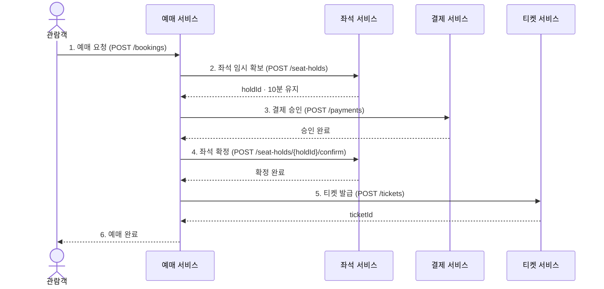
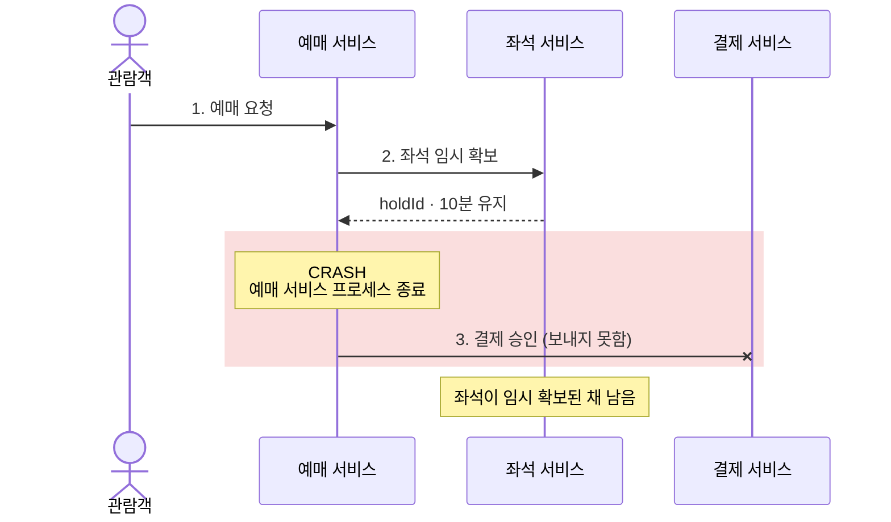
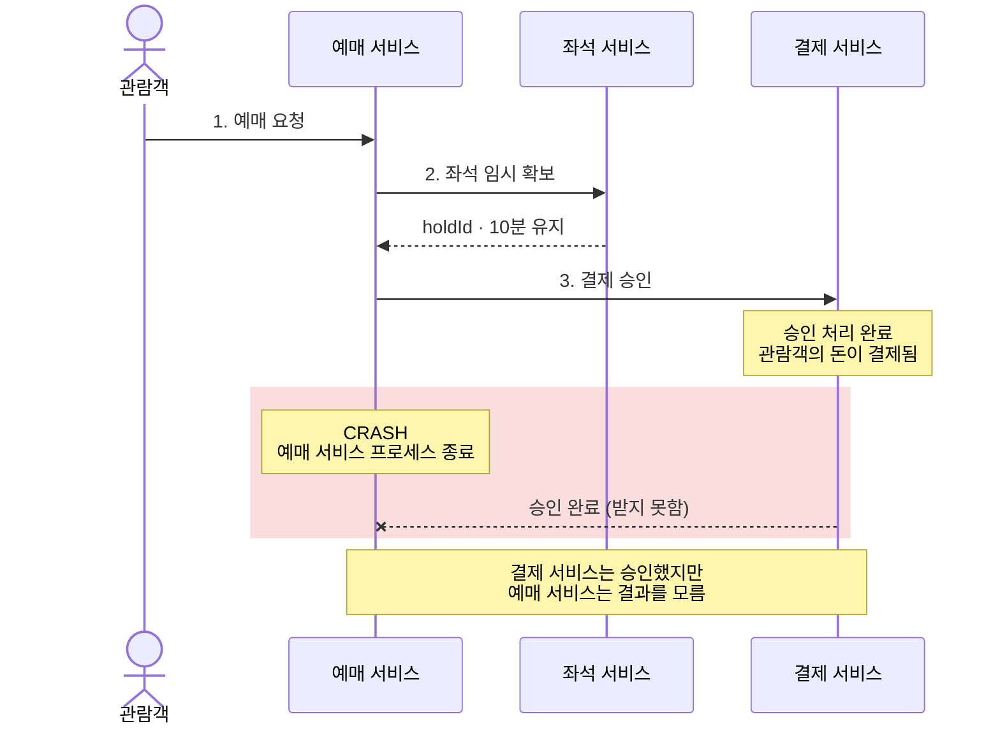
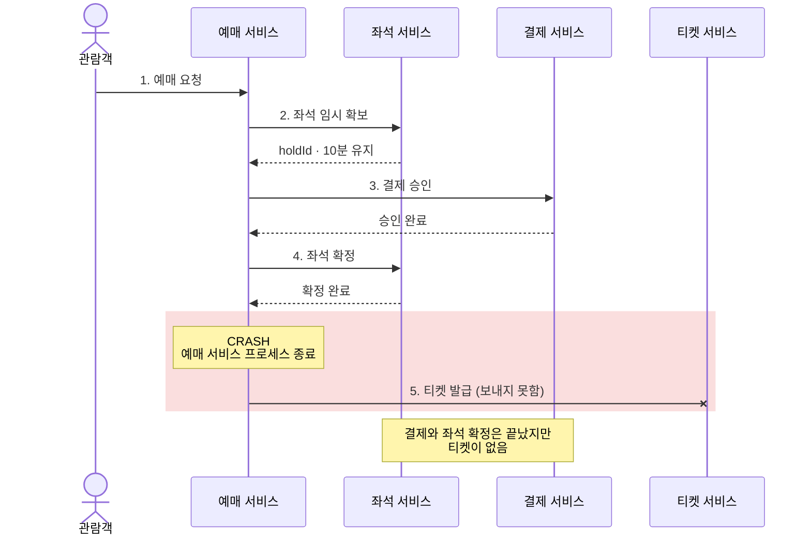
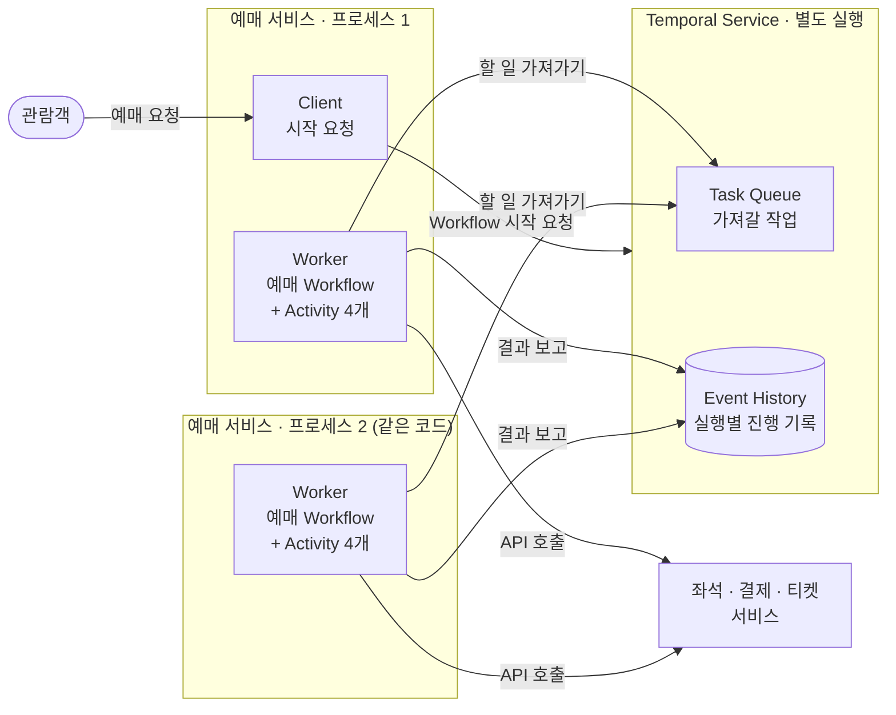
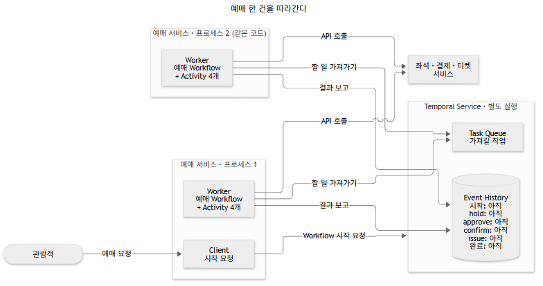

## 개요

대규모 시스템 관련 인프런 강의를 보다가 Temporal이라는 플랫폼을 알게 되었다.
이 글은 Temporal이 무엇인지, 그리고 어떤 상황에서 어떻게 적용하여 활용할 수 있을지 고민하고 학습하기 위한 글이다.

일단 다음과 같은 공연 예매 서비스가 있다고 가정해 보자.

### 가상의 예제: 공연 예매 서비스

이 절의 서비스 구성, API 경로, 이벤트 이름은 설명을 위해 정한 가정이다. 실제 예매 시스템을 조사해 옮긴 구조는 아니다.

- **사용자**: 인기 공연의 좌석을 골라 예매하는 관람객
- **목적**: 관람객이 고른 좌석을 결제와 함께 확정하고 모바일 티켓을 발급한다. 한 좌석을 두 사람에게 팔면 안 되고, 결제한 관람객은 티켓을 받거나 환불을 받아야 한다.

**구성하는 서비스와 기능, 서비스별 제공하는 API**

예매는 서비스 네 개가 나눠 처리한다. 예매 서비스가 나머지 세 서비스의 API를 차례로 호출해 예매 한 건을 끝낸다.

| 서비스      | 맡는 기능                                                  | 제공하는 API                                                                           |
| ----------- | ---------------------------------------------------------- | -------------------------------------------------------------------------------------- |
| 예매 서비스 | 예매 요청 접수, 예매 상태 관리, 다른 서비스 호출 순서 진행 | `POST /bookings`, `GET /bookings/{bookingId}`                                          |
| 좌석 서비스 | 좌석 임시 확보(10분 유지), 확정, 해제                      | `POST /seat-holds`, `POST /seat-holds/{holdId}/confirm`, `DELETE /seat-holds/{holdId}` |
| 결제 서비스 | 외부 결제 대행사(PG)를 통한 결제 승인과 취소               | `POST /payments`, `POST /payments/{paymentId}/cancel`                                  |
| 티켓 서비스 | 입장에 쓰는 모바일 티켓 발급                               | `POST /tickets`                                                                        |

**주요 이벤트의 종류와 서비스 흐름**

여기서 이벤트는 예매 업무에서 여러 서비스에 걸쳐 발생하는 Action을 뜻한다. 이 예제는 이벤트를 메시지로 주고받지 않고, 예매 서비스의 HTTP 호출로 다음 단계를 진행한다.

| 순서 | 이벤트           | 일어나는 곳 | 뜻                                               |
| ---- | ---------------- | ----------- | ------------------------------------------------ |
| 1    | 예매 요청됨      | 예매 서비스 | 관람객이 좌석과 결제 수단을 골라 예매를 요청했다 |
| 2    | 좌석 임시 확보됨 | 좌석 서비스 | 10분 동안 다른 관람객이 그 좌석을 고를 수 없다   |
| 3    | 결제 승인됨      | 결제 서비스 | 관람객의 돈이 결제됐다                           |
| 4    | 좌석 확정됨      | 좌석 서비스 | 그 좌석이 이 관람객에게 팔렸다                   |
| 5    | 티켓 발급됨      | 티켓 서비스 | 입장에 쓸 모바일 티켓이 생겼다                   |
| 6    | 예매 완료됨      | 예매 서비스 | 예매가 끝났고 관람객에게 알렸다                  |

실패하면 다른 이벤트가 생긴다. 결제가 거절되면 「결제 실패됨」 뒤에 「좌석 해제됨」이 온다. 결제 뒤의 단계가 끝내 실패하면 「결제 취소됨」으로 돈을 돌려주고, 확보했던 좌석도 다시 팔 수 있게 되돌린다.

위 서비스가 정상적으로 동작할 때의 흐름은 다음과 같다.



그림 1. 예매 서비스가 다른 세 서비스를 차례로 호출하는 정상 흐름이다. 화살표 앞의 번호(단계)는 위 이벤트 표의 순서와 같다. 실패는 그리지 않았다.

하지만 중요한 것은 위처럼 여러 서비스로(예: MSA) 동작하는 서비스의 경우 여러 지점에서 예외 상황과 장애 등이 발생할 수 있다는 점이다. 그리고 그 결과는 서비스 장애 및 데이터 정합성 불일치 등 서비스에 치명적인 문제가 될 것이다.

그림 1의 흐름에서 처리가 멈출 수 있는 지점 세 곳만 골라 보면 다음과 같다.

| 멈춘 지점                                | 남는 상태                                            | 생기는 문제                                                  |
| ---------------------------------------- | ---------------------------------------------------- | ------------------------------------------------------------ |
| 2단계 뒤, 결제 전 (그림 1-1)             | 좌석이 임시 확보된 채 남는다                         | 10분이 지나 풀릴 때까지 다른 관람객이 그 좌석을 고를 수 없다 |
| 3단계에서 결제 응답을 받기 전 (그림 1-2) | 결제 서비스는 승인했지만 예매 서비스는 결과를 모른다 | 예매 서비스가 결제 요청을 다시 보내면 두 번 결제될 수 있다   |
| 4단계 뒤, 5단계 전 (그림 1-3)            | 결제와 좌석 확정은 끝났지만 티켓이 없다              | 관람객이 결제하고도 입장할 수 없다                           |

아래 세 그림은 각 지점에서 예매 서비스 프로세스가 종료(crash)됐다고 가정한다. 「CRASH」 메모가 종료 위치이고, 끝이 X인 화살표는 보내지 못했거나 받지 못한 메시지다.



그림 1-1. 2단계의 응답을 받은 직후 예매 서비스가 종료됐다. 결제 요청은 결제 서비스에 도착하지 않았고 결제는 시작되지 않았다.



그림 1-2. 결제 서비스는 승인을 끝냈지만 예매 서비스는 그 응답을 받기 전에 종료됐다.



그림 1-3. 결제와 좌석 확정까지 끝난 뒤, 티켓 발급을 요청하기 전에 예매 서비스가 종료됐다. 아래 문단에서 이 경우를 자세히 본다.

세 경우 모두 각 서비스는 자기 일을 했다. 예매 결과는 DB에 남기지만, 몇 단계까지 끝났고 다음에 무엇을 할지는 그 요청을 처리하는 프로세스의 메모리에만 있다고 가정한다. 그래서 프로세스가 멈추면 어디서부터 이어갈지 알 수 없다.

그림 1-3의 상태에서 서버를 다시 켜는 것만으로 처리가 끝날까? 결제가 끝났다는 사실을 확인하고, 티켓이 이미 발급됐는지 살펴보고, 아직 하지 못한 일을 이어서 실행해야 한다. 같은 요청이 다시 들어왔다고 결제부터 반복해서도 안 된다.

모든 단계가 한 프로세스 안에서 하나의 DB 트랜잭션으로 끝난다면, 중간에 실패해도 트랜잭션을 되돌리면(롤백) 된다. 이 예제는 그렇게 할 수 없다. 좌석과 티켓은 다른 서비스가 각자의 DB에 저장하고, 결제는 외부 결제 대행사(PG)가 처리한다. 예매 서비스의 트랜잭션을 되돌려도 이미 끝난 결제는 취소되지 않는다. 그래서 어디까지 끝났는지 확인하고, 남은 일을 이어서 하거나 끝난 일을 따로 취소하는 처리가 필요하다.

Temporal은 이처럼 **중간에 멈출 수 있는 업무의 진행을 기록하고, 장애 뒤에도 이어갈 수 있도록 돕는 실행 플랫폼**이다. 이 글에서는 Temporal이 무엇을 해 주는지 개요를 살펴본다. 구성 요소의 세부 동작, Temporal이 해결하는 것과 개발자에게 남는 것은 이어지는 글에서 다룬다. ([Temporal 소개](https://docs.temporal.io/temporal))

## 정상 흐름보다 어려운 것은 중단 이후다

각 작업을 서로 다른 서비스가 처리하면 한 번의 호출이 끝났다는 사실만으로 전체 업무가 끝나지는 않는다.

재시도만 추가해서는 해결되지 않는다. 이미 끝난 작업, 결과를 모르는 작업, 아직 시작하지 않은 작업을 구별해야 하기 때문이다.

직접 구현한다면 다음 다섯 가지를 만들어야 한다.

1. 진행 상태를 DB에 저장한다.
2. 멈춘 요청을 주기적으로 찾아 남은 일을 이어 가는 복구 배치를 만든다.
3. 재시도 간격과 종료 조건을 관리한다.
4. 같은 요청이 다시 와도 결제나 발급이 반복되지 않도록 멱등성을 설계한다. 멱등성은 같은 작업을 다시 요청해도 업무 효과가 한 번만 생기는 성질이다.
5. 일부 작업만 끝났을 때 결과 확인·재시도·보상으로 업무를 마무리하는 규칙을 정한다.

Temporal을 도입하면 진행 상태 저장, 멈춘 업무 이어 가기, 재시도 실행은 Temporal이 맡는다. 외부 서비스의 중복 처리 방지와 업무를 마무리하는 규칙은 개발자에게 남는다. 왜 이렇게 나뉘는지는 4편(초안) [Temporal이 해결하는 것과 해결하지 못하는 것](/posts/temporal-04-what-it-solves/#temporal이-해결하는-것과-해결하지-못하는-것)에서 정리한다.

## Temporal은 업무의 진행을 기록하고 멈춘 곳부터 이어 간다

Temporal을 한 문장으로 말하면 **여러 단계로 된 업무를 코드로 작성하면, 단계가 끝날 때마다 결과를 기록해 두고, 프로세스가 멈추면 그 기록을 바탕으로 멈춘 다음 단계부터 이어 실행해 주는 플랫폼**이다.

Temporal은 이것을 **Durable Execution**이라고 부른다. 하나의 업무 실행을 Workflow Execution이라고 부른다. ([Workflow Execution](https://docs.temporal.io/workflow-execution))

이때 보존하는 것은 실행 중인 컴퓨터의 메모리 전체가 아니다. Temporal은 실행에 필요한 사건을 Event History에 기록한다. 업무 시작, 각 단계의 완료, 타이머 만료 같은 사건이 복구의 근거가 된다. ([Event History](https://docs.temporal.io/workflow-execution/event))

### 예매 업무를 Workflow와 Activity로 나눠 본다

Temporal을 쓰면 예매 서비스의 코드는 두 종류로 나뉜다.

1. **Workflow**는 업무의 순서를 적은 코드다. “좌석을 임시 확보하고, 결제를 승인받고, 좌석을 확정하고, 티켓을 발급한다”는 흐름과 실패했을 때 무엇을 할지가 여기에 들어간다.
2. **Activity**는 그 순서 안의 한 단계를 실제로 수행하는 코드다. 좌석·결제·티켓 서비스를 호출하는 일처럼 바깥 시스템과 통신하는 작업을 Activity로 만든다.

예매 Workflow를 코드 모양으로 적으면 다음과 같다. Temporal Java SDK를 Kotlin에서 쓸 때의 모양을 줄인 것으로, 설정과 어노테이션은 뺐다. 주석의 단계 번호는 그림 1과 같다.

```kotlin
// 예매 Workflow: 업무의 순서만 적는다. seatActivity처럼 Activity 객체를 부르는 줄이 Activity 실행이다.
fun reserve(request: BookingRequest): BookingResult {
    val hold = seatActivity.hold(request.seatId)         // 2. 좌석 임시 확보
    val payment = paymentActivity.approve(request, hold) // 3. 결제 승인
    seatActivity.confirm(hold)                           // 4. 좌석 확정
    val ticket = ticketActivity.issue(request, payment)  // 5. 티켓 발급
    return BookingResult(ticket)                         // 6. 예매 완료
}
```

### 예매 서비스와 Temporal Service는 따로 실행된다

위 코드는 우리 예매 서비스 안에서 실행된다. Temporal Service는 따로 실행하는 서버이고, 좌석·결제·티켓 서비스는 바꾸지 않는다. 그림 2의 상자는 다음과 같다.

1. **Client**: 예매 요청을 받으면 Temporal Service에 예매 Workflow를 시작해 달라고 요청한다.
2. **Worker**: 예매 Workflow와 Activity 코드를 실제로 실행하는 부분이다. Temporal Service에서 할 일을 가져가 실행하고 결과를 보고한다. 좌석·결제·티켓 서비스는 Activity가 호출한다.
3. **Temporal Service**: 우리 코드를 실행하지 않는다. 할 일을 Task Queue(작업이 Worker를 기다리는 대기열)에 쌓아 두고, 보고받은 결과를 Event History에 기록한다.



그림 2. Temporal을 쓴 예매 서비스의 구성이다. 같은 코드로 띄운 프로세스가 둘 있다. 화살표는 요청을 먼저 보내는 쪽에서 나가며, Temporal Service가 앱을 먼저 부르지 않고 Worker가 할 일을 가져간다. 이 그림은 예매 서비스 하나가 Client와 Worker를 함께 실행한다고 단순화했다. 2편에서는 이를 `booking-api`(Client)와 `booking-worker`(Worker) 서버로 나누고 작업 종류와 순서를 본다.

### 같은 서비스를 두 개 띄우면 Worker도 두 개가 된다

Worker는 따로 설치하는 프로그램이 아니라 우리 앱 프로세스 안에서 도는 부분이다. Spring Boot라면 Temporal 스타터(`temporal-spring-boot-starter`)가 앱이 뜰 때 Worker를 함께 시작한다. 그래서 같은 예매 서비스를 두 개 띄우면 그림 2처럼 Worker도 두 개가 되고, 둘은 같은 Task Queue에서 할 일을 나눠 가져간다. 할 일 하나는 가져간 Worker 하나만 실행한다. 한쪽이 멈춰도 다른 쪽이 이어 갈 수 있는 것은 이 때문이다. 여러 대를 함께 운영할 때 주의할 점은 4편(초안) [운영 방식과 이력에 남길 데이터도 정해야 한다](/posts/temporal-04-what-it-solves/#운영-방식과-이력에-남길-데이터도-정해야-한다)에서 다룬다. ([Task Queue](https://docs.temporal.io/task-queue))

### 프로세스가 멈추면 기록된 다음 단계부터 이어 간다

겉으로는 평범한 함수 호출이지만 실행 방식이 다르다. 결제 승인 결과가 기록된 뒤에 프로세스 1이 종료됐다고 하자. 그림 3은 그림 2의 구성 위에서 이 예매 한 건이 어떻게 이어지는지 한 단계씩 보여 준다.

[](./assets/booking-temporal-flow.gif)

그림 3. 결제 승인 결과가 기록된 뒤 프로세스 1이 종료된 예매 한 건이 프로세스 2에서 이어지는 순서다. 굵은 파란 선은 그 장면에서 오가는 요청, 빨간 점선 영역은 종료된 프로세스다. 그림을 누르면 원래 크기로 볼 수 있고, 같은 순서를 아래 목록으로도 적었다.

1. 관람객이 예매를 요청하면 프로세스 1의 Client가 Temporal Service에 예매 Workflow 시작을 요청한다. Event History에 시작이 기록된다.
2. 프로세스 1의 Worker가 Task Queue에서 할 일을 가져가 `reserve()`를 실행한다.
3. `hold`와 `approve`에서 Activity가 좌석·결제 서비스를 호출하고 Worker가 결과를 보고한다. Temporal Service는 각 결과를 Event History에 기록한다.
4. 결제 승인 결과까지 기록된 뒤 프로세스 1이 종료된다. 일정 시간이 지나면 Temporal Service는 다음 할 일을 다른 Worker가 가져갈 수 있게 다시 준비한다. 가져갈 Worker가 없으면 다시 뜰 때까지 진행이 멈춘다.
5. 프로세스 2의 Worker가 그 할 일을 Event History와 함께 받아 `reserve()`를 처음부터 다시 실행한다.
6. `hold`·`approve` 줄도 다시 지나가지만 좌석·결제 서비스를 부르지 않고 기록된 결과를 돌려받는다.
7. 서비스 호출은 `confirm`부터 이어진다. `issue`의 결과까지 기록되면 예매 Workflow의 완료가 기록된다.

이 과정을 이력 재생(replay)이라고 한다. 직접 구현하려면 만들어야 한다고 적은 진행 상태 테이블은 Event History가, 복구 배치는 위 4~6번이 대신한다. ([Worker 장애 뒤의 재생](https://docs.temporal.io/encyclopedia/event-history/event-history-java))

단, 3번에서 결과를 보고하기 전에 프로세스가 멈추면 이력에 완료 기록이 없다. 그러면 그 Activity는 다시 실행된다. 이 경우와 재생이 되기 위한 조건은 2편(초안) [재생의 조건과 Activity가 다시 실행되는 경우](/posts/temporal-02-execution-model/#재생의-조건과-activity가-다시-실행되는-경우)에서 다룬다.

## 이어지는 글에서 구성 요소와 Temporal의 경계를 다룬다

Temporal을 소개하는 앞부분은 다음 순서로 이어진다. 2·4·5편은 아직 검토 중인 초안이고, 3편은 준비 중이다.

1. 1편(이 글): 중간에 멈춘 업무를 Temporal이 어떻게 이어 가는가
2. [2편](/posts/temporal-02-execution-model/)(초안): 구성 요소와 실행 순서, 재생의 조건
3. 3편: 2편의 예매 서버 중 `booking-api`·`booking-worker`·`seat-api`를 로컬에서 띄워 구성 요소를 확인한다(준비 중)
4. [4편](/posts/temporal-04-what-it-solves/)(초안): Temporal이 해결하는 것(재시도·대기 포함)과 개발자에게 남는 것
5. [5편](/posts/temporal-05-ecosystem/)(초안): 개발 주체와 라이선스, 다른 언어 연동, 공개 사례, 비슷한 도구 비교

그 뒤에는 비교 기준이 될 예매 서비스를 먼저 Temporal 없이 만들어 실패를 직접 처리해 보고, 그 조정 부분에 Temporal을 점진적으로 넣는다.

---

공식 자료 확인일: 2026-10-05(Worker가 실행되는 위치와 일을 나누는 방식은 2026-10-10). 이 글은 개념 소개 글이며, 본문의 예매 상황은 실측 보고가 아닌 설명용 가정이다.
