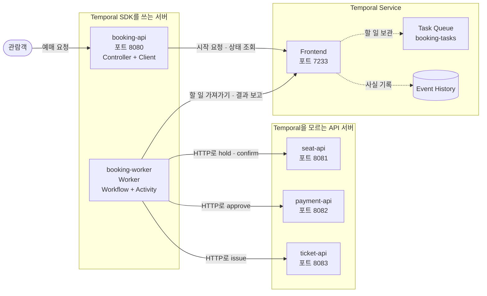
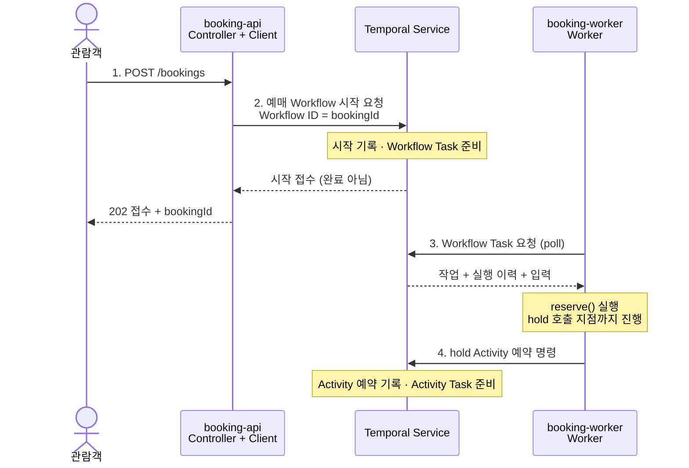
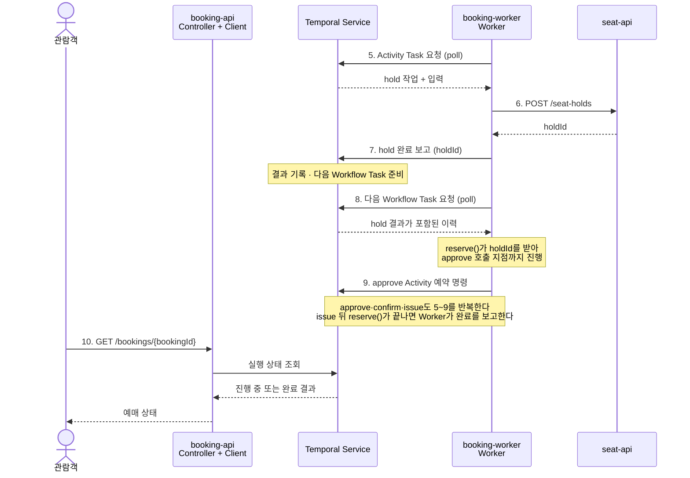

## 개요

### 1편에서 배운 것

[1편](/posts/temporal-01-overview/)에서는 간단하게 Temporal이 무엇인지 공연 예매 예제를 기반으로 다음을 살펴봤다.

1. 예매 서비스가 좌석·결제·티켓 서비스를 차례로 호출하는 도중 프로세스가 멈추면, 좌석만 묶이거나, 결제 결과를 모르거나, 결제하고도 티켓이 없는 상태가 남는다.
2. 좌석·티켓은 각 서비스의 DB에, 결제는 외부 결제 대행사에 있으므로 DB 트랜잭션 하나로 되돌릴 수 없다.
3. Temporal에서는 업무 순서를 Workflow로, 각 단계를 Activity로 작성한다. Temporal은 단계가 끝날 때마다 결과를 Event History에 기록하고, 프로세스가 멈추면 다른 프로세스가 그 기록으로 멈춘 다음 단계부터 이어 간다.
4. 이를 위해 예매 서비스(Client·Worker)와 별도로 실행하는 Temporal Service(Task Queue·Event History)가 함께 동작한다.

### 이번 편에서 배울 것

1편은 「Temporal이 무엇을 해 주는가」를 봤다. 이번 편은 그 동작을 **누가 어디서, 어떤 순서로 하는지** 본다.

1. 1편의 예매 예제를 Spring Boot 멀티모듈 서버 다섯 개로 나눠, 각 서버가 무엇을 실행하는지와 예매 요청 한 건이 어떤 작업으로 바뀌어 진행되는지 순서대로 따라간다.
2. 재생이 되기 위한 조건과, 이미 실행한 Activity가 다시 실행되는 경우를 본다.

재시도 정책과 기다리는 업무(타이머·Signal)는 4편에서 Temporal이 맡는 일과 함께 본다.

### 이 글에서 쓰는 용어

1편을 읽었다면 넘어가도 된다.

1. **Workflow**: 업무의 순서를 적은 코드다. 실행 하나하나를 Workflow Execution이라 부르고, 개발자가 정하는 Workflow ID로 찾는다.
2. **Activity**: 외부 API 호출처럼 실제 일을 하는 한 단계의 코드다.
3. **Worker**: 우리 서버(이 예제에서는 `booking-worker`) 안에서 Workflow·Activity 코드를 실제로 실행하는 부분이다.
4. **Client**: Workflow 실행을 시작하거나 결과를 받으려고 Temporal Service에 요청하는 SDK 객체다.
5. **Temporal Service**: 실행 이력(Event History)을 저장하고 Worker가 가져갈 작업을 관리하는 서버다. 우리 코드를 실행하지는 않는다.
6. **Task Queue**: Temporal Service 안에서 작업이 Worker를 기다리는 대기열의 이름이다.
7. **재생(replay)**: Worker가 바뀌었을 때 기록된 이력으로 Workflow 코드를 처음부터 다시 실행해 멈춘 지점까지 상태를 되살리는 과정이다. 결과가 이미 기록된 Activity는 다시 실행하지 않는다.
8. **Frontend**: Temporal Service의 요청 입구다(포트 7233). Client·Worker·Web UI가 모두 여기로 접속한다. 웹 화면(Web UI)과는 다르다. ([Temporal Service 구성](https://docs.temporal.io/temporal-service/temporal-server))

[1편 그림 2](/posts/temporal-01-overview/#예매-서비스와-temporal-service는-따로-실행된다)와 비교하면, 1편의 예매 서비스는 이번 편에서 `booking-api`(Client)와 `booking-worker`(Worker)로 나뉘고, 좌석·결제·티켓 서비스는 `seat-api`·`payment-api`·`ticket-api`가 된다. 1편에서 Worker가 Task Queue·Event History로 바로 가는 것처럼 그린 화살표는 실제로는 Frontend를 거친다.

## 예매 예제를 서버 다섯 개로 나눠 실행한다

이번 편부터 예제는 1편의 공연 예매다. 하나의 Gradle 멀티모듈 프로젝트에 모듈 여섯 개를 두고, 그중 다섯 개를 각각 독립된 Spring Boot 서버로 띄운다. 아래는 **실행 원리를 설명하는 예제 설계**이며 모듈 이름과 포트 번호는 이 연재에서 정한 가정이다. 실제 코드와 실행 확인은 3편(준비 중)에서 한다.

### 모듈마다 무엇을 실행하는가

| 모듈             | 실행                                   | 들어 있는 것                                      | 하는 일                                                                                                                            |
| ---------------- | -------------------------------------- | ------------------------------------------------- | ---------------------------------------------------------------------------------------------------------------------------------- |
| `booking-api`    | API 서버, 포트 8080                    | 예매 Controller + Temporal Client                 | 관람객의 예매 요청을 받아 Temporal Service에 예매 Workflow 시작을 요청한다. 예매가 진행 중인지 끝났는지 알려 주는 조회 API도 둔다. |
| `booking-worker` | Worker 프로세스, HTTP 요청을 받지 않음 | Worker + 예매 Workflow·Activity 구현              | Temporal Service에서 할 일을 가져와 Workflow 코드를 진행하고, Activity로 좌석·결제·티켓 서버를 HTTP로 호출한다.                    |
| `seat-api`       | API 서버, 포트 8081                    | 좌석 Controller                                   | 좌석 임시 확보·확정·해제                                                                                                           |
| `payment-api`    | API 서버, 포트 8082                    | 결제 Controller                                   | 결제 승인·취소. 학습용이라 실제 결제 대행사 대신 정해진 응답을 돌려준다.                                                           |
| `ticket-api`     | API 서버, 포트 8083                    | 티켓 Controller                                   | 모바일 티켓 발급                                                                                                                   |
| `common`         | 실행하지 않음                          | 예매 Workflow·Activity 인터페이스, 요청·응답 형식 | `booking-api`와 `booking-worker`가 함께 쓴다.                                                                                      |

Temporal Service는 이 프로젝트 밖에서 따로 실행한다. 이 연재에서는 Docker로 띄운 개발 서버(`temporal server start-dev`)를 쓴다. SDK는 Frontend의 7233 포트로 접속하고, Web UI는 8233 포트다. 이 구성에서 알아 둘 것은 넷이다.

1. **Temporal을 아는 서버는 둘뿐이다.** `booking-api`는 Client로 시작을 요청하고 `booking-worker`는 Worker로 할 일을 가져간다. 좌석·결제·티켓 서버는 Temporal SDK가 없는 평범한 API 서버다.
2. **Workflow 코드는 `booking-worker`에서 실행된다.** `booking-api`의 Client는 Temporal Service에 요청하는 SDK 객체일 뿐 Workflow를 실행하지 않는다.
3. **Temporal Service는 서버를 먼저 부르지 않는다.** `booking-worker`가 할 일을 가져가고 결과를 보고한다. 그래서 `booking-worker`가 꺼져 있으면 시작 요청은 접수돼도 예매가 진행되지 않는다. ([Worker의 실행 위치](https://docs.temporal.io/workers))
4. **다른 서버를 부르는 것은 Activity다.** Workflow는 순서만 정하고, 실제 HTTP 호출은 Activity 구현이 한다. ([Spring Boot 통합](https://docs.temporal.io/develop/java/integrations/spring-boot-integration))

그림 1. 예매 예제를 서버 다섯 개로 나눠 실행한 구성이다. 실선 화살표는 요청을 먼저 보내는 쪽에서 나가며, 화살표 이름의 `hold` 등은 그 서버를 부르는 Activity다. 점선은 Temporal Service 내부의 전달로, 그림 2·3의 점선(응답)과 뜻이 다르다. Temporal Service 내부는 단순화했다. 실제로는 Frontend가 받은 요청을 History 서비스가 기록하고 Matching 서비스가 Task Queue로 전달한다. 좁은 화면에서는 그림을 좌우로 밀어 본다.

### 예매 요청 한 건이 작업으로 바뀌어 진행되는 과정

예매 Workflow `reserve()`는 1편의 코드 모양처럼 `hold` → `approve` → `confirm` → `issue` 순서로 Activity를 요청하고 결과를 기다린다. 작업 전달에는 `booking-tasks`라는 Task Queue 이름을 쓴다고 정하자. `booking-api`가 시작을 요청할 때 지정한 이름과 `booking-worker`가 할 일을 요청하는 이름을 맞춘다. Activity도 따로 지정하지 않으면 같은 Task Queue 이름을 쓴다.

**Task Queue는 Temporal Service가 관리**하며, Workflow 코드를 진행하라는 작업(Workflow Task)과 Activity를 실행하라는 작업(Activity Task)은 구분한다. Worker는 시작된 상태에서 작업을 요청하고 응답을 기다린다. 이를 polling이라 부르며 SDK가 처리한다. ([Task의 종류](https://docs.temporal.io/tasks))

아래 두 그림은 첫 단계인 좌석 임시 확보(`hold`)까지만 확대해 따라간다. 결제·좌석 확정·티켓 발급도 같은 순서를 반복한다. 실선 화살표는 요청·명령·보고, 점선 화살표는 응답이다.

그림 2. 예매 요청이 Workflow 시작으로 이어지고, Workflow가 첫 Activity를 요청하는 단계다. `booking-worker`의 3번 요청은 미리 와서 기다리고 있을 수 있어, 3번 이후는 202 응답과 거의 동시에 일어난다.

1. **관람객이 예매를 요청한다.** `POST /bookings`를 `booking-api`의 Controller가 받는다.
2. **Client가 시작을 요청하고 Temporal Service가 첫 작업을 준비한다.** Controller는 예매 번호(`bookingId`)를 만들고, Client로 Workflow 종류, 입력, Workflow ID(`bookingId`)와 Task Queue 이름을 지정해 요청한다. Temporal Service는 시작 사실을 기록하고 Workflow Task를 준비한다. 예매는 여러 서버를 거쳐 오래 걸릴 수 있으므로 `booking-api`는 결과를 기다리지 않고 `202`와 `bookingId`를 바로 돌려준다. 1편 그림 1처럼 끝까지 기다려 응답할 수도 있지만 이 예제는 접수만 먼저 알린다.
3. **`booking-worker`가 Workflow 코드를 실행한다.** Workflow Task를 받아 `reserve()`를 실행하고, 첫 Activity인 `hold`를 부르는 지점까지 진행한다.
4. **Activity 요청은 Temporal Service를 거친다.** Worker의 SDK가 `hold` Activity 예약 명령을 보내고, Temporal Service가 Activity Task를 준비한다. 같은 프로세스 안에 구현이 있어도 Workflow가 Activity 구현 메서드를 직접 부르는 흐름은 아니다.

그림 3. 그림 2에 이어 `hold` Activity가 실제로 `seat-api`를 부르고, Workflow가 다음 단계로 넘어가는 순서다. **Activity 완료와 Workflow 완료는 별개**다. 10번 조회는 2번 응답 뒤 언제든 할 수 있다.

5. **`booking-worker`가 Activity Task를 받는다.** 받은 작업은 `hold`이고 입력은 좌석 번호다.
6. **Activity 구현이 `seat-api`를 HTTP로 부른다.** `POST /seat-holds`로 좌석을 임시 확보하고 `holdId`를 받는다. `seat-api`는 이 요청이 Temporal에서 왔는지 모른다.
7. **Worker가 Activity 결과를 보고한다.** Temporal Service가 `holdId`를 기록하고 Workflow를 다시 진행할 작업을 준비한다.
8. **Worker가 다음 Workflow Task를 받는다.** SDK가 기록된 `holdId`를 Workflow에 전달하고, `reserve()`는 `approve`를 부르는 지점까지 진행한다.
9. **다음 Activity를 예약한다.** `approve`·`confirm`·`issue`도 5~9를 반복하며 각각 `payment-api`·`seat-api`·`ticket-api`를 부른다. `issue`까지 끝나 `reserve()`가 반환되면 Worker가 Workflow 완료 명령을 보내고, Temporal Service가 완료를 기록한다.
10. **관람객은 조회 API로 예매 상태를 확인한다.** `booking-api`는 Temporal Service에서 실행이 진행 중인지 끝났는지, 끝났다면 결과가 무엇인지 받아 알려 준다. 어느 단계까지 왔는지 알려 주려면 Workflow에 Query를 두어야 하는데, Query는 Worker가 답하므로 `booking-worker`가 꺼져 있으면 받을 수 없다. ([Query](https://docs.temporal.io/develop/java/workflows/message-passing))

실패·재시도는 생략한 정상 흐름이다. 핵심은 **Workflow Task → Activity Task → 다음 Workflow Task**로 작업 종류가 바뀌면서 같은 업무 실행이 진행된다는 것이다. ([공식 실행 과정](https://docs.temporal.io/encyclopedia/architecture/how-temporal-works))

### Temporal에서 Event는 무엇인가

HTTP 요청은 이번 예제의 **시작 계기**다. Temporal의 **Event**는 Temporal Service가 실행 이력에 남기는 「일어난 사실」이다. 1편 예매 예제의 업무 이벤트(「예매 요청됨」 등)와 다르고, Worker가 받을 **Task**나 Worker가 다음 행동을 요청하는 **Command**와도 구분한다. ([Event History](https://docs.temporal.io/workflow-execution/event))

| 시점                     | 이력에 남는 대표 이벤트      | 뜻                                  |
| ------------------------ | ---------------------------- | ----------------------------------- |
| 시작 접수                | `WorkflowExecutionStarted`   | 예매 실행이 시작됐다.               |
| `hold` 예약              | `ActivityTaskScheduled`      | 좌석 임시 확보 Activity를 예약했다. |
| `hold` 결과 보고 후      | `ActivityTaskCompleted`      | `holdId`가 기록됐다.                |
| 나머지 세 단계           | 위 두 이벤트가 단계마다 반복 | 결제 승인·좌석 확정·티켓 발급       |
| 마지막 단계 완료 처리 후 | `WorkflowExecutionCompleted` | 예매 실행 전체가 끝났다.            |

표는 주요 사건만 추렸다. 실제 이력에는 Workflow Task의 예약·시작·완료 등도 들어간다. 3편(준비 중)에서는 Web UI에서 이 기록을 확인하고, 각 서버의 로그에서 코드가 실행된 위치를 대조한다.

## 재생의 조건과 Activity가 다시 실행되는 경우

[1편](/posts/temporal-01-overview/#프로세스가-멈추면-기록된-다음-단계부터-이어-간다)에서는 Activity 결과가 기록된 뒤에 Worker가 종료된 경우를 봤다. 그때 재생은 기록된 결과를 돌려주므로 완료된 결제 API를 다시 호출하지 않는다. ([Workflow 정의와 재생](https://docs.temporal.io/workflow-definition))

이번에는 **결제사에서는 승인이 끝났지만 Worker가 완료를 보고하기 전에 종료된 상황**이다. Temporal에 완료가 기록되지 않았고, Temporal은 Worker가 죽은 것을 직접 알지 못한다. 그래서 Start-To-Close 타임아웃(한 번의 실행에 허용하는 시간)이나 Heartbeat 타임아웃이 지나야 실패로 보고, 재시도 정책에 따라 Activity를 다시 실행한다. 재시도 정책의 기본값과 설정은 4편 [Temporal이 대신 해 주는 일](/posts/temporal-04-what-it-solves/#temporal이-대신-해-주는-일)에서 다룬다. 이때 외부 결제가 중복되지 않도록 멱등 키(같은 요청이 다시 와도 한 번만 처리되게 하는 키)를 설계해야 한다. 멱등 키를 만드는 순서는 4편 [개발자에게 남는 일](/posts/temporal-04-what-it-solves/#개발자에게-남는-일)에서 다룬다. ([Activity와 멱등성](https://docs.temporal.io/activity-definition))

재생이 가능하려면 Workflow 코드에도 제약이 있다. 같은 이력으로 재생했을 때 실행 명령의 흐름이 일관돼야 한다. 그래서 Workflow 안에서 외부 HTTP 요청을 직접 보내거나 일반 시간·난수 API를 무작정 사용하지 않는다. 외부 작업은 Activity에 두고 시간·대기 등은 SDK가 제공하는 방식을 사용한다. ([Workflow의 결정성](https://docs.temporal.io/workflow-definition))

## 다음 글에서는 로컬에서 Temporal의 구성 요소를 직접 확인한다

3편에서는 로컬에 Temporal Service를 실행하고 이 멀티모듈 예제의 `booking-api`·`booking-worker`·`seat-api`를 직접 띄워, 이 글에서 본 Client·Worker·Temporal Service의 역할을 실행 로그와 Web UI의 실행 이력으로 구별한다. 3편은 아직 준비 중이니, 그동안 [4편](/posts/temporal-04-what-it-solves/)에서 Temporal이 해결하는 것과 개발자에게 남는 것을 먼저 읽어도 된다.

---

공식 자료 확인일: 2026-10-05(Activity가 다시 실행되는 시점은 2026-10-09, Frontend·Query는 2026-10-10). 이 글은 개념 소개 초안이며, 예매 예제의 모듈·포트는 실행 원리를 설명하는 설계이고 실행 결과가 아니다.
