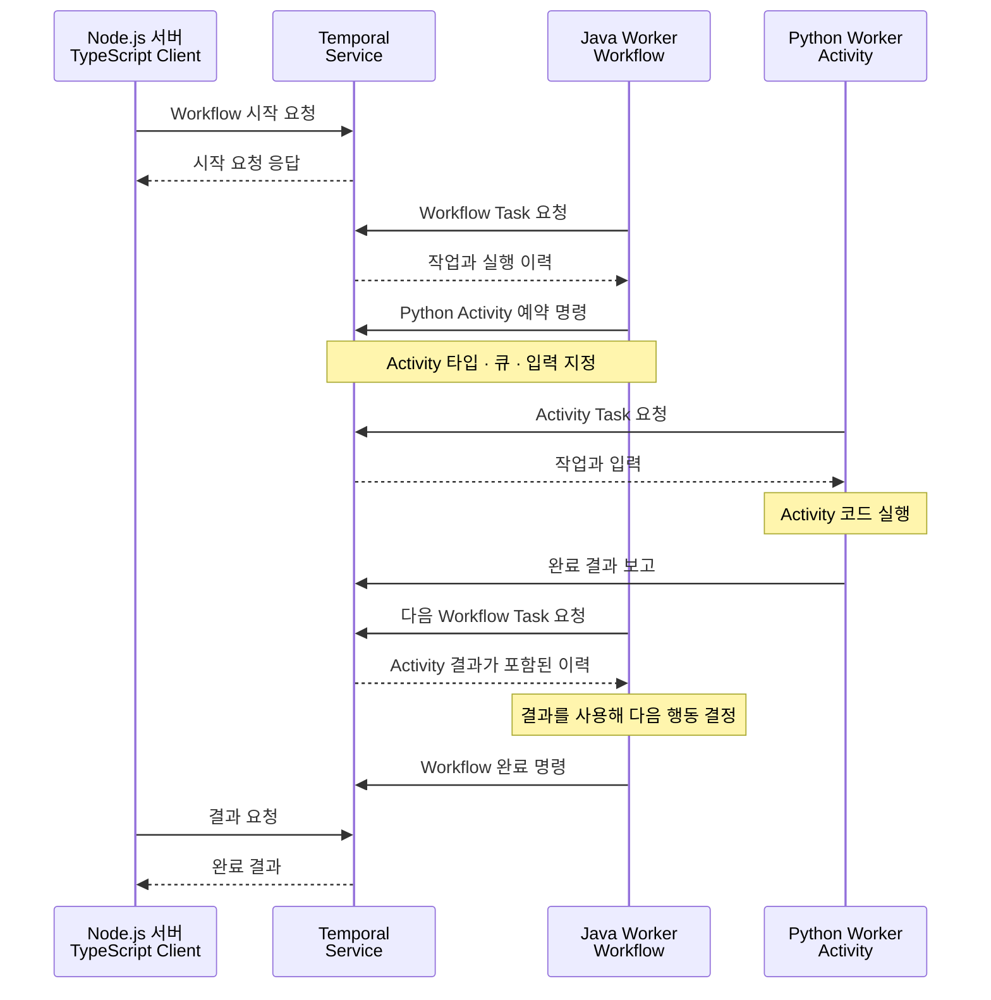

앞 글에서는 Temporal이 무엇을 해 주고([1편](/posts/temporal-01-overview/)), 어떻게 실행되며([2편](/posts/temporal-02-execution-model/)), 무엇이 개발자에게 남는지([4편](/posts/temporal-04-what-it-solves/)) 봤다. 이 글은 Temporal을 둘러싼 환경을 본다.

1. 누가 만들고 어떤 라이선스로 공개하는가
2. Java·Kotlin이 아닌 서버를 함께 연결하는 방법
3. 공개된 사용 사례
4. 비슷한 도구와의 차이
5. 2026년 10월 기준 릴리스 동향

## Temporal은 누가 만들고 어떻게 공개하는가

Temporal의 공동 창업자는 Maxim Fateev와 Samar Abbas다. 두 사람은 Uber에서 Cadence를 만들었고, 2019년 독립해 Temporal을 시작했다. Temporal은 Cadence에서 갈라져 발전한 프로젝트이며 Temporal Technologies가 개발을 이끈다. ([공식 역사](https://temporal.io/blog/temporal-raises-usd550m-series-e-at-usd12-55b-valuation-ai), [Cadence와의 관계](https://temporal.io/temporal-versus/cadence))

서버와 SDK 소스는 GitHub의 temporalio 조직에서 공개한다. 구성 요소별 라이선스는 구분해서 확인해야 한다. Temporal Server는 MIT, 이 연재에서 Kotlin과 함께 사용할 Java SDK는 Apache-2.0이다. ([Server 라이선스](https://github.com/temporalio/temporal/blob/main/LICENSE), [Java SDK 라이선스](https://github.com/temporalio/sdk-java/blob/main/LICENSE))

서비스 운영 주체도 구별하자. **관리형 서비스인 Temporal Cloud는 Temporal Technologies Inc.가 제공한다.** Uber는 앞서 설명한 Cadence의 출발점이다. 직접 운영할지 Cloud를 쓸지에 따라 우리 팀이 맡는 일은 4편 [운영 방식과 이력에 남길 데이터도 정해야 한다](/posts/temporal-04-what-it-solves/#운영-방식과-이력에-남길-데이터도-정해야-한다)에서 다룬다. ([Cloud 제공 법인과 약관](https://temporal.io/terms-of-service), [공식 Server 저장소](https://github.com/temporalio/temporal))

## Node.js·Python 서버도 함께 참여할 수 있다

Temporal은 Java·Kotlin 전용 도구가 아니다. **2026-10-05 기준 공식 SDK는 .NET, Go, Java, PHP, Python, Ruby, Rust, TypeScript의 8종**이다. Rust SDK도 2026-09-23 정식 지원인 GA를 발표했다. Kotlin은 Java SDK를 사용하고 Kotlin 보조 모듈을 추가할 수 있다. 각 SDK의 최신 기능과 실행 환경 조건은 별도로 확인해야 한다. ([SDK 목록](https://docs.temporal.io/develop), [Rust GA 발표](https://temporal.io/blog/build-durable-applications-rust-temporal-rust-sdk-now-generally-available), [Kotlin 지원 모듈](https://github.com/temporalio/sdk-java/blob/main/temporal-kotlin/README.md))

Node.js에서는 TypeScript SDK로 TypeScript·JavaScript 코드를 작성할 수 있고, Python SDK도 Client·Workflow·Activity·Worker를 제공한다. TypeScript Worker는 Node.js의 실행 기능에 의존하므로 브라우저나 모든 JavaScript 런타임에서 그대로 실행된다고 보면 안 된다. ([TypeScript SDK](https://github.com/temporalio/sdk-typescript), [Python SDK](https://python.temporal.io/))

### SDK로 서로 다른 언어의 작업을 연결한다

서버마다 언어가 달라도 역할별 Worker와 데이터 계약을 정하면 함께 사용할 수 있다. 아래는 문서에 근거한 구성 예시이며, 이 글에서 실행한 실습 결과는 아니다.

1. Node.js API 서버의 Client가 Workflow 타입 이름과 ID, 처리할 Task Queue, 입력을 지정해 Temporal Service에 시작을 요청한다.
2. Java·Kotlin Worker가 해당 큐에서 작업을 받아 Workflow 코드를 실행한다.
3. Workflow가 Python Activity의 타입 이름과 처리 큐를 지정해 실행을 요청한다.
4. Python Worker가 그 큐에서 작업을 받아 실행하고 결과를 Temporal Service에 보고한다.
5. Temporal Service에 기록된 결과를 Java·Kotlin Workflow가 다음 작업을 통해 받아 후속 단계를 진행한다.

그림 1. 서로 다른 언어가 Temporal Service를 통해 작업과 결과를 주고받는 정상 흐름이다. Workflow·Activity는 역할에 맞는 별도 Task Queue를 사용하며 같은 Namespace(한 Temporal Service 안에서 Workflow 실행을 나누는 격리 단위) 접근·인증·타입 이름·입력과 결과 형식을 맞춰야 한다. 시작 응답은 업무 완료가 아니다. 결과 대기 요청은 완료 전에 보낼 수도 있다. 재시도·타임아웃·보상은 이 그림에서 생략했다.

여기서 Node.js가 Java Worker에 직접 HTTP 요청을 보내는 것은 아니다. **Worker가 Temporal Service에서 작업을 가져오고 결과를 보고한다.** 공식 다언어 샘플도 Java Workflow에서 Go·Node.js Activity를 호출하는 구성을 제공한다. 언어마다 별도 처리 큐를 두면 실행할 타입을 모르는 Worker가 작업을 받는 문제를 피하기 쉽다. ([공식 다언어 샘플](https://github.com/temporalio/temporal-polyglot), [Task Queue](https://docs.temporal.io/task-queue))

입력·결과의 필드명, 숫자·날짜·null 표현, 오류와 재시도 정책을 맞춰야 한다. 암호화·압축을 적용하면 데이터 변환 설정도 호환되어야 한다. Java 객체가 Python 객체로 자동 공유되는 것은 아니다. 또한 서로 다른 언어의 작업을 호출할 수 있다는 설명은 Python Worker가 Java Workflow 구현을 그대로 이어받는다는 뜻이 아니다. ([데이터 변환](https://docs.temporal.io/dataconversion), [Workflow 정의와 재생](https://docs.temporal.io/workflow-definition))

### 기존 HTTP 서버를 그대로 호출할 수도 있다

기존 Node.js·Python 서버를 모두 Worker로 바꿀 필요는 없다. Activity가 기존 HTTP API를 호출하는 방법도 있다.

1. Workflow가 Activity 실행을 요청한다.
2. Activity Worker가 기존 서버의 HTTP API를 호출한다.
3. Activity가 API 결과를 보고하고 Workflow가 다음 단계를 결정한다.

이 방식에서는 호출받는 서버에 Temporal SDK가 없어도 된다. 다만 기존 API 내부의 진행까지 Temporal이 자동으로 기록하는 것은 아니다. API가 처리에 성공했는데 응답이 끊기면 Activity가 호출을 다시 시도할 수 있으므로, 기존 API도 멱등 키(같은 요청이 다시 와도 한 번만 처리되게 하는 키)를 받아 중복 요청을 알아봐야 한다(4편 [개발자에게 남는 일](/posts/temporal-04-what-it-solves/#개발자에게-남는-일)). ([Activity의 역할](https://docs.temporal.io/activities))

## 실제로 어떤 문제에 사용했는가

공개 사례는 회사 이름보다 적용한 업무를 살펴보는 편이 도움이 된다. 다음은 각 자료가 발표됐을 때 공개한 범위다.

### Snap — 여러 서비스를 연결하는 처리와 배포

Snap은 2021년 엔지니어링 글에서 광고 보고서의 데이터 조회·보고서 생성·알림을 예로 들어, 여러 서비스 사이의 상태 추적과 장애 처리를 설명했다. 실제 활용 사례로는 여러 빌드 시스템과 배포 서비스를 연결하는 CI/CD 파이프라인도 소개했다. 서비스별 기능은 이미 있어도 전체 순서와 복구를 관리하는 일이 별도로 남는다는 점을 보여 준다. ([Snap 엔지니어링 글](https://eng.snap.com/build_a_reliable_system_in_a_microservices_world_at_snap))

### Descript — 음성을 글로 바꾸는 여러 단계의 처리

Descript의 2024년 공개 사례는 음성 전사 과정의 재인코딩·청크 분할·외부 API 호출·결과 병합을 다룬다. 여러 단계를 조합하고 테스트하며, 문제가 생긴 실행의 상태를 추적하는 데 Temporal을 활용했다. 오래 걸리는 데이터 처리에서 중간 결과와 후속 작업을 관리하는 사례다. ([Descript 사례](https://temporal.io/resources/case-studies/descript))

### Stripe — Kafka 운영 작업의 조정

Stripe의 Current 2024 발표는 Kafka 제어 평면(control plane, 클러스터 설정과 운영 작업을 맡는 부분)에서 브로커 교체·클러스터 재균형·토픽 설정 등을 조정한 사례다. 오랫동안 실행되면서 시스템 상태를 바꾸는 운영 작업을 안전하게 관리하려는 맥락이다. 이 발표를 Stripe의 결제 처리 전체가 Temporal에서 동작한다는 근거로 확대해서는 안 된다. ([Stripe 발표](https://current.confluent.io/2024-sessions/mastering-kafka-at-scale-unleashing-the-power-of-temporal-at-stripe))

### Netflix — 클라우드 인프라 작업의 복구

Netflix는 2025-12-15 자체 기술 글에서 내부 Spinnaker의 Clouddriver가 수행하는 클라우드 운영 작업에 Temporal을 적용했다고 설명했다. 클라우드 API 호출을 Activity로 분리하고 진행 상태와 재시도를 관리한 사례다. Netflix의 비공개 Spinnaker 변경에 관한 설명이므로 공개 Spinnaker 전체나 영상 스트리밍 전체가 Temporal로 동작한다고 확대해서는 안 된다. ([Netflix 기술 글](https://netflixtechblog.com/how-temporal-powers-reliable-cloud-operations-at-netflix-73c69ccb5953))

### Airbnb — 개인화 알림의 진행 관리

Airbnb는 2023-05-11 자체 기술 글에서 Journey Platform을 소개했다. 이메일·앱 알림 등 개인화된 사용자 안내 흐름을 작성하는 내부 도구이며, Temporal을 상태 유지와 실행 관리에 사용한다. 승인이나 사용자 행동을 기다리는 업무와 연결해 볼 수 있는 사례다. 이 발표는 Airbnb의 모든 예약·결제 처리가 Temporal이라는 근거는 아니다. ([Airbnb 기술 글](https://medium.com/airbnb-engineering/journey-platform-a-low-code-tool-for-creating-interactive-user-workflows-9954f51fa3f8))

### OpenAI — 공급사가 공개한 Codex 웹 에이전트 사례

Temporal의 2025-11-12 공식 글은 OpenAI의 Codex 웹 에이전트를 도입 사례로 든다. 이는 **공급사인 Temporal의 설명**이며, 이번 조사에서 OpenAI 자체의 상세 아키텍처 자료까지 확인한 것은 아니다. ChatGPT 전체나 모든 Codex 실행 방식에 적용되는 설명으로 넓히지 않는다. ([Temporal의 AI 에이전트 설명](https://temporal.io/blog/of-course-you-can-build-dynamic-ai-agents-with-temporal))

이 사례들은 발표 당시 공개한 적용 범위다. Snap·Netflix·Airbnb는 고객 자체 기술 글, Stripe는 해당 기업의 콘퍼런스 발표, Descript·OpenAI는 Temporal이 공개한 자료라는 차이가 있다. 발표 이후 내부 구조가 계속 같은지는 외부에서 확정하기 어렵다. 사례를 비교하면 여러 작업의 순서와 중간 상태, 실패 뒤 복구를 함께 관리한다는 공통점을 찾을 수 있다. 이것은 사례를 읽고 정리한 해석이며, 유명 기업의 도입 자체가 우리 서비스의 도입 근거가 되지는 않는다.

## 비슷한 도구는 무엇이 다르고 얼마나 관심을 받는가

업무 흐름을 관리하는 도구는 여러 종류다. 코드로 실행 순서를 작성하는 Temporal·Cadence·Restate·DBOS, 특정 클라우드의 관리형 실행 환경과 묶인 AWS Step Functions·Azure Durable Functions, BPMN으로 업무 절차를 모델링하는 Camunda를 비교할 수 있다. BPMN은 업무의 작업·분기·참여자를 정해진 기호로 표현하는 표준이다. 아래 적합 조건은 각 제품의 공식 구조를 바탕으로 한 이 글의 판단이며, 성능 측정 순위는 아니다.

### 7개 도구의 작성 방식과 운영 부담 비교

| 도구·공식 근거                                                                                                               | 작성·복구 방식                                                                                | 운영 형태와 검토할 조건                                                                                                              |
| ---------------------------------------------------------------------------------------------------------------------------- | --------------------------------------------------------------------------------------------- | ------------------------------------------------------------------------------------------------------------------------------------ |
| [Temporal](https://docs.temporal.io/)                                                                                        | SDK로 Workflow·Activity 작성. Temporal Service의 이력을 이용해 Worker가 실행 상태를 복구한다. | 자체 운영 또는 Temporal Cloud. 장기 대기·분기·복구를 코드로 표현할 때 검토한다. Worker 배포·재생 호환성·멱등성 관리가 필요하다.      |
| [Cadence](https://cadenceworkflow.io/docs/concepts/workflows)                                                                | 코드 Workflow와 Activity, 실행 이력에 기반한 복구를 제공한다.                                 | 서비스와 Worker를 운영한다. 기존 Cadence 자산·경험을 활용할 때 비교하며 결정성 규칙과 운영 구성을 살핀다.                            |
| [Restate](https://docs.restate.dev/)                                                                                         | 서비스 코드에 SDK를 적용하고 완료한 단계의 결과를 기록해 재사용한다.                          | 자체 운영·Cloud·자체 클라우드 계정 배포 선택이 있다. 서비스 호출과 상태 관리를 함께 다룰 때 런타임·SDK 제약을 비교한다.              |
| [DBOS](https://docs.dbos.dev/architecture)                                                                                   | 라이브러리로 Workflow·Step을 정의하고 PostgreSQL에 단계 결과를 저장한다.                      | 별도 오케스트레이션 서버 없이 앱과 PostgreSQL로 시작한다. 분산 복구는 Conductor 또는 별도 조정이 필요하며 DB 가용성·성능도 검토한다. |
| [AWS Step Functions](https://docs.aws.amazon.com/step-functions/latest/dg/welcome.html)                                      | 상태 머신을 정의하고 AWS가 실행 상태를 관리한다. Retry·Catch로 오류 정책을 지정한다.          | AWS 관리형. AWS 서비스 연동이 중심일 때 검토하며 실행 유형·시간·과금 조건을 확인한다.                                                |
| [Azure Durable Functions](https://learn.microsoft.com/en-us/azure/durable-task/durable-functions/durable-functions-overview) | Functions 코드로 orchestrator·activity 등을 작성하며 런타임이 상태와 복구를 관리한다.         | Azure Functions와 저장소 구성을 사용한다. 기존 Functions 환경과 잘 맞는지, 호스팅·저장소·코드 규칙을 살핀다.                         |
| [Camunda 8](https://docs.camunda.io/docs/components/concepts/concepts-overview/)                                             | BPMN 업무 모델과 Job Worker를 연결하며 엔진이 프로세스 상태를 관리한다.                       | SaaS 또는 자체 운영. 사람의 승인·업무 담당자와의 공동 설계가 중요할 때 검토하며 모델·운영·라이선스 조건을 확인한다.                  |

Airflow·Prefect·n8n도 비교 후보가 될 수 있지만 주된 출발점이 다르다. Airflow는 배치와 데이터 파이프라인, Prefect는 Python 데이터 작업, n8n은 업무 자동화의 관점에서 먼저 살펴보는 편이 유용하다. 이름에 Workflow가 들어간다는 이유만으로 같은 요구를 해결한다고 보면 선택 기준이 흐려진다. ([Airflow](https://airflow.apache.org/docs/apache-airflow/stable/index.html), [Prefect](https://docs.prefect.io/v3/get-started), [n8n](https://docs.n8n.io/))

### 전체 시장 순위와 GitHub 관심도는 다르다

실제 사용 기업 수나 시장점유율을 같은 방식으로 집계한 공통 통계는 이번 조사에서 확보하지 못했다. 대신 **2026-10-05 14:08 KST에 공개 서버·엔진 저장소 네 곳의 GitHub 별 수를 같은 API 필드로 조회**했다.

| 이 네 저장소 안의 순서 | 공개 서버·엔진 저장소                                                             | 별 수  |
| ---------------------- | --------------------------------------------------------------------------------- | ------ |
| 1                      | [temporalio/temporal](https://api.github.com/repos/temporalio/temporal)           | 23,468 |
| 2                      | [cadence-workflow/cadence](https://api.github.com/repos/cadence-workflow/cadence) | 9,469  |
| 3                      | [restatedev/restate](https://api.github.com/repos/restatedev/restate)             | 4,520  |
| 4                      | [camunda/camunda](https://api.github.com/repos/camunda/camunda)                   | 4,310  |

**이 표에서는 Temporal에 대한 관심이 가장 높지만, 이를 전체 시장 1위라고 해석할 수는 없다.** 별은 관심 표시이며 저장소의 운영 기간·이관 이력·포함 범위도 다르다. 사용량·유료 고객 수·성능·팀 적합성을 직접 측정하지 않는다. DBOS는 언어별 라이브러리가 핵심이라 같은 단위에 넣지 않았고, AWS·Azure 관리형 서비스에도 대응하는 공개 서버 저장소 수치가 없어 순위를 매기지 않았다. 제외된 제품의 인기가 낮다는 뜻은 아니다. ([DBOS 구조](https://docs.dbos.dev/architecture))

## 2026년 10월에도 릴리스와 개선이 이어지고 있다

관리 주체가 있다는 사실만으로 유지보수가 활발하다고 판단할 수는 없다. 실제 릴리스를 확인하면 **Server와 Java·TypeScript·Python SDK 모두 2026년 9월 정식 배포가 확인된다.** 다음은 2026-10-05에 확인한 GitHub 최신 정식 릴리스 표기이며 날짜는 UTC 기준이다.

| 구성 요소      | 확인한 버전                                                                  | UTC 공개일 |
| -------------- | ---------------------------------------------------------------------------- | ---------- |
| Server         | [v1.32.0](https://github.com/temporalio/temporal/releases/tag/v1.32.0)       | 2026-09-11 |
| Java SDK       | [v1.40.0](https://github.com/temporalio/sdk-java/releases/tag/v1.40.0)       | 2026-09-29 |
| TypeScript SDK | [v1.24.0](https://github.com/temporalio/sdk-typescript/releases/tag/v1.24.0) | 2026-09-15 |
| Python SDK     | [1.34.0](https://github.com/temporalio/sdk-python/releases/tag/1.34.0)       | 2026-09-30 |

Server 1.32.0은 Workflow에 넣지 않고 별도로 Activity를 실행하는 Standalone Activities를 정식 지원으로 전환했고 Worker 버전 관리·작업 수신량 자동 조절·관측 지표도 개선했다. 이 연재는 구성 이해를 위해 Workflow 안에서 Activity를 실행하는 기본 경로를 설명한다([2편](/posts/temporal-02-execution-model/)). 최신 릴리스에 포함됐더라도 개별 기능의 설정 방법과 지원 범위는 따로 확인해야 한다. ([Server 1.32.0 변경 내역](https://github.com/temporalio/temporal/releases/tag/v1.32.0))

SDK도 같은 시기에 발전했다. TypeScript 1.24.0은 Standalone Activities API를 안정화하고 작업 수신 관련 오류를 수정했다. Java 1.40.0과 Python 1.34.0은 Cloud Run 인증 연동과 직렬화·역직렬화 등의 개선을 포함한다. 즉 신기능뿐 아니라 배포 환경 연동과 오류 수정도 이어지고 있다. ([TypeScript 변경 내역](https://github.com/temporalio/sdk-typescript/releases/tag/v1.24.0), [Java 변경 내역](https://github.com/temporalio/sdk-java/releases/tag/v1.40.0), [Python 변경 내역](https://github.com/temporalio/sdk-python/releases/tag/1.34.0))

최신 기능 계열과 가장 늦게 공개된 패치도 구분해야 한다. Server의 이전 계열인 1.31.3·1.30.7 보안 패치는 1.32.0보다 늦은 2026-09-18에 공개됐다. 따라서 버전 번호 하나보다 사용 계열의 보안 수정과 업그레이드 안내를 함께 읽어야 한다. 이 표는 공개 릴리스의 존재와 변경 내용을 확인한 결과이며, 해당 버전을 이 연재의 예매 예제에서 실행해 검증한 결과는 아니다. ([Server 릴리스 목록](https://github.com/temporalio/temporal/releases))

## 이후 글에서는 예매 예제를 직접 만든다

Temporal을 소개하는 글은 여기까지다. 3편에서는 Temporal을 익히려고 예매 서버 일부(`booking-api`·`booking-worker`·`seat-api`)를 Temporal과 함께 띄운다. 그것은 도구를 익히는 입문 실습이다. 이후 글에서는 비교 기준이 될 예매 서비스를 먼저 Temporal 없이 Kotlin·Spring Boot로 만들어 실패를 직접 처리해 보고, 그 서비스 간 조정 부분에 Temporal을 점진적으로 넣어 본다. 편 번호와 순서는 원고와 실습을 보며 정한다.

---

공식 자료 확인일: 2026-10-05. 이 글은 개념 소개 초안이며, 사례·비교·릴리스 내용은 공개 자료를 정리한 것이고 직접 실행해 검증한 결과는 아니다.
